Using R as a GIS
========================================================

Working with spatial data and basic GIS operations in R
-------------------------------------------------------
v 2.0  
15/02/2013   
Francisco Rodriguez-Sanchez  

Look for the latest version at
http://sites.google.com/site/rodriguezsanchezf


```r
setwd("~/UsingR-GIS")  # set working directory
```


BASIC PACKAGES
--------------


```r

library(sp)  # classes for spatial data
library(raster)  # grids, rasters
library(rasterVis)  # raster visualisation
library(maptools)
# and their dependencies
```


   
     
     
VISUALISING GEOGRAPHICAL DATA
=============================

  
  

RWORLDMAP: for mapping global data
----------------------------------


```r

library(rworldmap)

# examples:
newmap <- getMap(resolution = "coarse")  # different resolutions available
plot(newmap)
```

 


```r
mapCountryData()
```

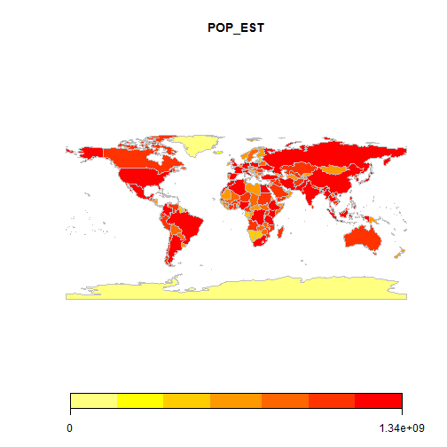 


```r
mapCountryData(mapRegion = "europe")
```

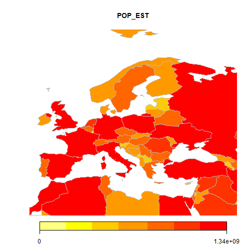 


```r
mapGriddedData()
```

 


```r
mapGriddedData(mapRegion = "europe")
```

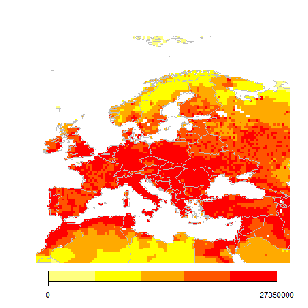 


  
    
GOOGLEVIS: visualise data in a web browser using Google Visualisation API
-------------------------------------------------------------------------


```r

library(googleVis)

# demo(googleVis) # run this demo to see all the possibilities
```


Example: plot country-level data

```r
data(Exports)
View(Exports)       # a simple data frame
Geo <- gvisGeoMap(Exports, locationvar="Country", numvar="Profit", 
                  options=list(height=400, dataMode='regions'))
# print(Geo)  # this prints HTML code that can be embedded in a web page!
plot(Geo)

```


Example: Plotting point data onto a google map (internet)

```r
data(Andrew)
M1 <- gvisMap(Andrew, "LatLong" , "Tip", options=list(showTip=TRUE, showLine=F, enableScrollWheel=TRUE,
                         mapType='satellite', useMapTypeControl=TRUE, width=800,height=400))
plot(M1)

```


  
    


RGOOGLEMAPS: Map your data onto Google Map tiles
------------------------------------------------


```r

library(RgoogleMaps)

# First, get maps from Google (a file will be saved in your working
# directory)
newmap <- GetMap(center = c(36.7, -5.9), zoom = 10, destfile = "newmap.png", 
    maptype = "satellite")

# Now using bounding box instead of center coordinates:
newmap2 <- GetMap.bbox(lonR = c(-5, -6), latR = c(36, 37), destfile = "newmap2.png", 
    maptype = "terrain")

# Try different maptypes
newmap3 <- GetMap.bbox(lonR = c(-5, -6), latR = c(36, 37), destfile = "newmap3.png", 
    maptype = "satellite")
```


```r
# Now plot data onto these maps, e.g. these 3 points
PlotOnStaticMap(lat = c(36.3, 35.8, 36.4), lon = c(-5.5, -5.6, -5.8), zoom = 10, 
    cex = 2, pch = 19, col = "red", FUN = points, add = F)
```

 


  
   
LIBRARY "DISMO": FUNCTION GMAP
------------------------------


```r

library(dismo)

# Some examples

# Getting maps for countries
mymap <- gmap("France")  # choose whatever country
plot(mymap)
```

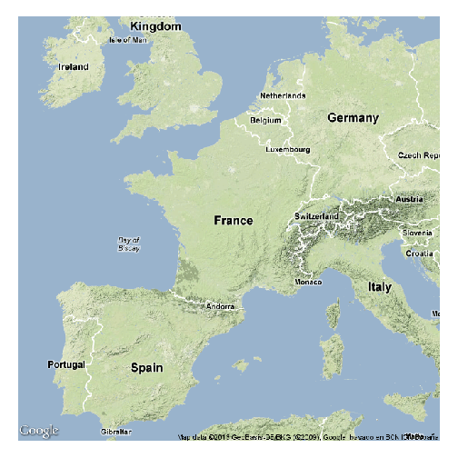 

```r
mymap <- gmap("France", type = "satellite")  # choose map type
plot(mymap)
```

 

```r
mymap <- gmap("France", type = "satellite", exp = 3)  # choose the zoom level
plot(mymap)
```

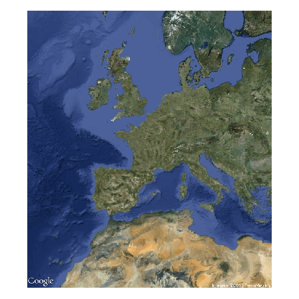 

```r

# Save the map as a file in your wd for future use
mymap <- gmap("France", type = "satellite", filename = "France.gmap")
```


```r
# Now get a map for a region drawn at hand
mymap <- gmap("Europe")
plot(mymap)
select.area <- drawExtent()  # now click 2 times on the map to select your region
mymap <- gmap(select.area)
plot(mymap)
# See ?gmap for many other possibilities

```


SPATIAL VECTOR DATA (POINTS, POLYGONS, ETC)
===========================================


Let's create an example dataset:

```r
# Get known locations of the laurel tree (Laurus nobilis) from GBIF
library(dismo)
laurus <- gbif("Laurus", "nobilis")
```

```
## Laurus nobilis : 2040 occurrences found
## 0-1000-2000-2040
```

```r
# get data frame with spatial coordinates (points)
locs <- subset(laurus, select = c("country", "lat", "lon"))
head(locs)  # a simple data frame with coordinates
```

```
##   country   lat   lon
## 1      DE 47.56  9.58
## 2      IL 33.25 35.68
## 3      IL 33.25 35.65
## 4      IL 33.24 35.68
## 5      IL 33.25 35.69
## 6      IL 33.25 35.65
```

```r

# Discard data with errors in coordinates:
locs <- subset(locs, locs$lat < 90)
```


Making your data 'spatial'

```r
coordinates(locs) <- c("lon", "lat")  # set spatial coordinates
plot(locs)
```

 


Define geographical projection:

```r
# to look for the appropriate PROJ.4 description look here:
# http://www.spatialreference.org/
crs.geo <- CRS("+proj=longlat +ellps=WGS84 +datum=WGS84")  # geographical, datum WGS84
proj4string(locs) <- crs.geo  # define projection system of our data
summary(locs)
```

```
## Object of class SpatialPointsDataFrame
## Coordinates:
##         min    max
## lon -122.68 145.04
## lat  -37.78  59.84
## Is projected: FALSE 
## proj4string :
## [+proj=longlat +ellps=WGS84 +datum=WGS84 +towgs84=0,0,0]
## Number of points: 2032
## Data attributes:
##    Length     Class      Mode 
##      2032 character character
```


Plotting point data on a map

```r
plot(locs, pch = 20, col = "steelblue")
library(rworldmap)
# library rworldmap provides different types of global maps, e.g:
data(coastsCoarse)
data(countriesLow)
plot(coastsCoarse, add = T)
```

 


Subsetting

```r
table(locs@data$country)  # see localities of Laurus nobilis by country
```

```
## 
##   AU   DE   ES   FR   GB   GR   IE   IL   IT   PT   SE   US 
##    2    1  206    1  501   23   46 1231    2    1    3   12
```

```r
locs.gr <- subset(locs, locs$country == "GR")  # select only locs in Greece
plot(locs.gr, pch = 20, cex = 2, col = "steelblue")
title("Laurus nobilis occurrences in Greece")
plot(countriesLow, add = T)
```

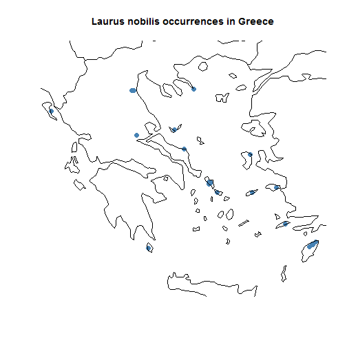 

```r
summary(locs.gr)
```

```
## Object of class SpatialPointsDataFrame
## Coordinates:
##       min   max
## lon 19.92 28.15
## lat 36.25 40.13
## Is projected: FALSE 
## proj4string :
## [+proj=longlat +ellps=WGS84 +datum=WGS84 +towgs84=0,0,0]
## Number of points: 23
## Data attributes:
##    Length     Class      Mode 
##        23 character character
```

```r

locs.gb <- subset(locs, locs$country == "GB")  # locs in UK
plot(locs.gb, pch = 20, cex = 2, col = "steelblue")
title("Laurus nobilis occurrences in UK")
plot(countriesLow, add = T)
```

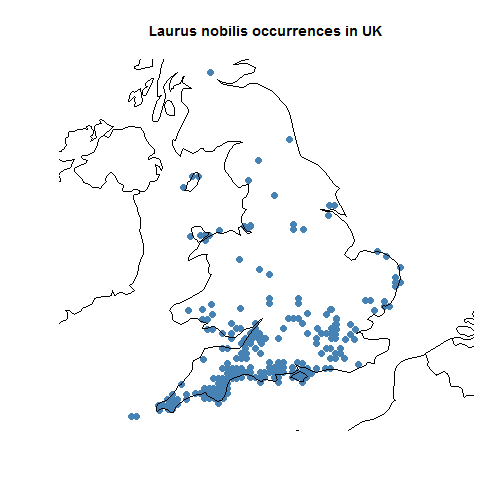 


MAKING MAPS WITH VECTORIAL SPATIAL DATA (POINTS, POLYGONS, POLYLINES)
=====================================================================


USING RGOOGLEMAPS
-----------------


```r

require(RgoogleMaps)
locs.gb.coords <- as.data.frame(coordinates(locs.gb))  # retrieves coordinates (1st column for longitude, 2nd column for latitude)
PlotOnStaticMap(lat = locs.gb.coords$lat, lon = locs.gb.coords$lon, zoom = 5, 
    cex = 1.4, pch = 19, col = "red", FUN = points, add = F)
```

 

```r

## Downloading map from Google Maps and plotting onto it
map.lim <- qbbox(locs.gb.coords$lat, locs.gb.coords$lon, TYPE = "all")  # define region of interest (bounding box)
mymap <- GetMap.bbox(map.lim$lonR, map.lim$latR, destfile = "gmap.png", maptype = "satellite")
```

```
## [1] "http://maps.google.com/maps/api/staticmap?center=53.086237,-2.30987445&zoom=6&size=640x640&maptype=satellite&format=png32&sensor=true"
```

```r
# see the file in the wd
PlotOnStaticMap(mymap, lat = locs.gb.coords$lat, lon = locs.gb.coords$lon, zoom = NULL, 
    cex = 1.3, pch = 19, col = "red", FUN = points, add = F)
```

 

```r

## using different background
mymap <- GetMap.bbox(map.lim$lonR, map.lim$latR, destfile = "gmap.png", maptype = "hybrid")
```

```
## [1] "http://maps.google.com/maps/api/staticmap?center=53.086237,-2.30987445&zoom=6&size=640x640&maptype=hybrid&format=png32&sensor=true"
```

```r
PlotOnStaticMap(mymap, lat = locs.gb.coords$lat, lon = locs.gb.coords$lon, zoom = NULL, 
    cex = 1.3, pch = 19, col = "red", FUN = points, add = F)
```

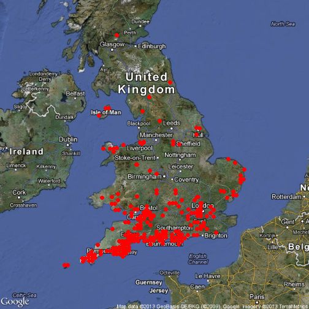 


USING "DISMO": FUNCTION GMAP
------------------------------


```r
gbmap <- gmap(locs.gb, type = "satellite")
locs.gb.merc <- Mercator(locs.gb)  # Google Maps are in Mercator projection. This function projects the points to that projection to enable mapping
plot(gbmap)
points(locs.gb.merc, pch = 20, col = "red")
```

 


PLOTTING ONTO A GOOGLE MAP USING GOOGLEVIS (internet)
-----------------------------------------------------


```r
points.gb <- as.data.frame(locs.gb)
points.gb$latlon <- paste(points.gb$lat, points.gb$lon, sep=":")
map.gb <- gvisMap(points.gb, locationvar="latlon", tipvar="country", 
                  options = list(showTip=T, showLine=F, enableScrollWheel=TRUE,
                           useMapTypeControl=T, width=1400,height=800))
plot(map.gb)
#print(map.gb)    # get HTML suitable for a web page
```


DRAWING POLYGONS AND POLYLINES
------------------------------


```r
plot(gbmap)
mypolygon <- drawPoly()  # click on the map to draw a polygon and press ESC when finished
summary(mypolygon)  # now you have a spatial polygon! Easy, isn't it?
```


CONVERTING, READING AND SAVING SPATIAL VECTOR DATA
==================================================


Exporting KML (Google Earth)
----------------------------

```r
writeOGR(locs.gb, dsn = "locsgb.kml", layer = "locs.gb", driver = "KML")
```


Reading kml
-----------

```r
newmap <- readOGR("locsgb.kml", layer = "locs.gb")
```

```
## OGR data source with driver: KML 
## Source: "locsgb.kml", layer: "locs.gb"
## with 501 features and 2 fields
## Feature type: wkbPoint with 2 dimensions
```


Saving as a Shapefile
---------------------

```r
writePointsShape(locs.gb, "locsgb")
```


Reading shapefiles
--------------------------

```r
gb.shape <- readShapePoints("locsgb.shp")
plot(gb.shape)
```

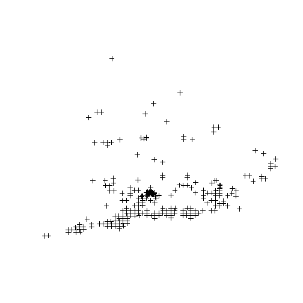 

```r

# readShapePoly # read polygon shapefiles readShapeLines # read polylines
# see also shapefile in 'raster'
```


CHANGING PROJECTION OF SPATIAL VECTOR DATA
==========================================


```r
# Projecting data frame with Laurus nobilis coordinates
summary(locs)  # original coordinates in lat lon
```

```
## Object of class SpatialPointsDataFrame
## Coordinates:
##         min    max
## lon -122.68 145.04
## lat  -37.78  59.84
## Is projected: FALSE 
## proj4string :
## [+proj=longlat +ellps=WGS84 +datum=WGS84 +towgs84=0,0,0]
## Number of points: 2032
## Data attributes:
##    Length     Class      Mode 
##      2032 character character
```

```r
# define new projection; look up parameters at http://spatialreference.org
crs.laea <- CRS("+proj=laea +lat_0=52 +lon_0=10 +x_0=4321000 +y_0=3210000 +ellps=GRS80 +units=m +no_defs")  # Lambert Azimuthal Equal Area
locs.laea <- spTransform(locs, crs.laea)  # spTransform makes the projection

# Projecting shapefile of countries
plot(countriesLow)  # countries map in geographical projection
```

 

```r
country.laea <- spTransform(countriesLow, crs.laea)  # project

# Plotting
plot(locs.laea, pch = 20, col = "steelblue")
plot(country.laea, add = T)
```

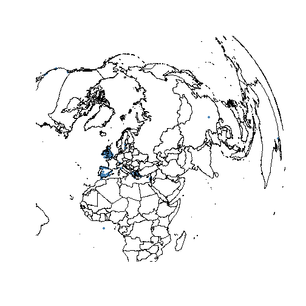 

```r
# define spatial limits for plotting
plot(locs.laea, pch = 20, col = "steelblue", xlim = c(1800000, 3900000), ylim = c(1e+06, 
    3e+06))
plot(country.laea, add = T)
```

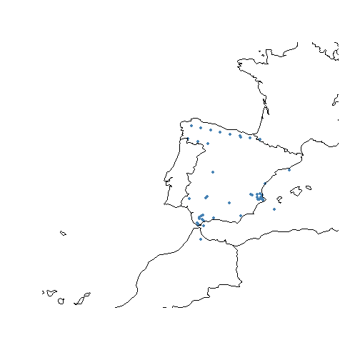 


OVERLAY
-------

Get number of occurrences (points) by country

```r
ov <- overlay(locs.laea, country.laea)
countr <- country.laea@data$NAME[ov]
summary(countr)
```

```
##                     Israel             United Kingdom 
##                       1218                        383 
##                      Spain                    Ireland 
##                        193                         43 
##                     Greece                    Lebanon 
##                         20                         12 
##              United States                     France 
##                          8                          4 
##                    Morocco                  Australia 
##                          4                          2 
##                Isle of Man                      Italy 
##                          2                          2 
##                     Sweden                      China 
##                          2                          1 
##                    Germany                  West Bank 
##                          1                          1 
##                Afghanistan                      Aland 
##                          0                          0 
##                    Albania                    Algeria 
##                          0                          0 
##             American Samoa                    Andorra 
##                          0                          0 
##                     Angola                   Anguilla 
##                          0                          0 
##                 Antarctica          Antigua and Barb. 
##                          0                          0 
##                  Argentina                    Armenia 
##                          0                          0 
##                      Aruba    Ashmore and Cartier Is. 
##                          0                          0 
##                    Austria                 Azerbaijan 
##                          0                          0 
##                    Bahamas                    Bahrain 
##                          0                          0 
##                 Bangladesh                   Barbados 
##                          0                          0 
##                    Belarus                    Belgium 
##                          0                          0 
##                     Belize                      Benin 
##                          0                          0 
##                    Bermuda                     Bhutan 
##                          0                          0 
##                    Bolivia           Bosnia and Herz. 
##                          0                          0 
##                   Botswana      Br. Indian Ocean Ter. 
##                          0                          0 
##                     Brazil         British Virgin Is. 
##                          0                          0 
##                     Brunei                   Bulgaria 
##                          0                          0 
##               Burkina Faso                    Burundi 
##                          0                          0 
##                   Cambodia                   Cameroon 
##                          0                          0 
##                     Canada                 Cape Verde 
##                          0                          0 
##                 Cayman Is.       Central African Rep. 
##                          0                          0 
##                       Chad                      Chile 
##                          0                          0 
##                   Colombia                    Comoros 
##                          0                          0 
##        Congo (Brazzaville)           Congo (Kinshasa) 
##                          0                          0 
##                   Cook Is.                 Costa Rica 
##                          0                          0 
##                    Croatia                       Cuba 
##                          0                          0 
##                    Curacao                     Cyprus 
##                          0                          0 
##                 Czech Rep.                    Denmark 
##                          0                          0 
##                   Djibouti                   Dominica 
##                          0                          0 
##             Dominican Rep.                 East Timor 
##                          0                          0 
##                    Ecuador                      Egypt 
##                          0                          0 
##                El Salvador                 Eq. Guinea 
##                          0                          0 
##                    Eritrea                    Estonia 
##                          0                          0 
##                   Ethiopia               Falkland Is. 
##                          0                          0 
##                  Faroe Is.                       Fiji 
##                          0                          0 
##                    Finland              Fr. Polynesia 
##                          0                          0 
## Fr. S. and Antarctic Lands                      Gabon 
##                          0                          0 
##                     Gambia                       Gaza 
##                          0                          0 
##                    Georgia                      Ghana 
##                          0                          0 
##                  Greenland                    Grenada 
##                          0                          0 
##                       Guam                  Guatemala 
##                          0                          0 
##                    (Other)                       NA's 
##                          0                        136
```

```r

```


USING RASTER (GRID) DATA
========================


DOWNLOADING RASTER CLIMATE DATA FROM INTERNET
---------------------------------------------


```r
tmin <- getData("worldclim", var = "tmin", res = 10)  # this will download global data on minimum temperature at 10' resolution
# with this function you can also get other climatic data, elevation,
# administrative boundaries, etc
```


LOADING A RASTER LAYER
----------------------


```r
tmin1 <- raster("~/UsingR-GIS/wc10/tmin1.bil")  # Tmin for January
fromDisk(tmin1)  # values are stored on disk instead of memory! (useful for large rasters)
```

```
## [1] TRUE
```

```r
tmin1 <- tmin1/10  # Worldclim temperature data come in decimal degrees
tmin1  # look at the info
```

```
## class       : RasterLayer 
## dimensions  : 900, 2160, 1944000  (nrow, ncol, ncell)
## resolution  : 0.1667, 0.1667  (x, y)
## extent      : -180, 180, -60, 90  (xmin, xmax, ymin, ymax)
## coord. ref. : +proj=longlat +ellps=WGS84 +towgs84=0,0,0,0,0,0,0 +no_defs 
## data source : in memory
## names       : layer 
## values      : -54.7, 26.6  (min, max)
```

```r
plot(tmin1)
```

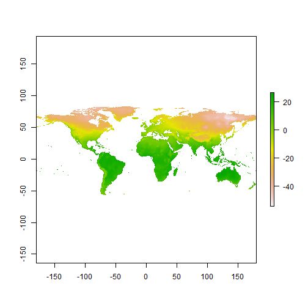 

```r

# ?raster # raster reads many different formats, including Arc ASCII grids
# or netcdf files
```


CREATING A RASTER STACK
-----------------------

A raster stack is collection of many raster layers with the same projection, spatial extent and resolution


```r

library(gtools)
list.ras <- mixedsort(list.files("~/UsingR-GIS/wc10/", full.names = T, pattern = ".bil"))
list.ras  # I have just collected a list of the files containing monthly temperature values
```

```
##  [1] "C:/Users/FRS/Documents/UsingR-GIS/wc10/tmin1.bil" 
##  [2] "C:/Users/FRS/Documents/UsingR-GIS/wc10/tmin2.bil" 
##  [3] "C:/Users/FRS/Documents/UsingR-GIS/wc10/tmin3.bil" 
##  [4] "C:/Users/FRS/Documents/UsingR-GIS/wc10/tmin4.bil" 
##  [5] "C:/Users/FRS/Documents/UsingR-GIS/wc10/tmin5.bil" 
##  [6] "C:/Users/FRS/Documents/UsingR-GIS/wc10/tmin6.bil" 
##  [7] "C:/Users/FRS/Documents/UsingR-GIS/wc10/tmin7.bil" 
##  [8] "C:/Users/FRS/Documents/UsingR-GIS/wc10/tmin8.bil" 
##  [9] "C:/Users/FRS/Documents/UsingR-GIS/wc10/tmin9.bil" 
## [10] "C:/Users/FRS/Documents/UsingR-GIS/wc10/tmin10.bil"
## [11] "C:/Users/FRS/Documents/UsingR-GIS/wc10/tmin11.bil"
## [12] "C:/Users/FRS/Documents/UsingR-GIS/wc10/tmin12.bil"
```

```r
tmin.all <- stack(list.ras)
tmin.all
```

```
## class       : RasterStack 
## dimensions  : 900, 2160, 1944000, 12  (nrow, ncol, ncell, nlayers)
## resolution  : 0.1667, 0.1667  (x, y)
## extent      : -180, 180, -60, 90  (xmin, xmax, ymin, ymax)
## coord. ref. : +proj=longlat +ellps=WGS84 +towgs84=0,0,0,0,0,0,0 +no_defs 
## names       : tmin1, tmin2, tmin3, tmin4, tmin5, tmin6, tmin7, tmin8, tmin9, tmin10, tmin11, tmin12 
## min values  :  -547,  -525,  -468,  -379,  -225,  -170,  -171,  -178,  -192,   -302,   -449,   -522 
## max values  :   266,   273,   277,   283,   295,   312,   311,   312,   300,    268,    267,    268
```

```r
tmin.all <- tmin.all/10
plot(tmin.all)
```

 


RASTER BRICKS
-------------

A rasterbrick is similar to a raster stack (i.e. multiple layers with the same extent and resolution),
but all the data must be stored in a single file


```r
tmin.brick <- brick(tmin.all)  # creates rasterbrick
```


CROP RASTERS
------------


```r

## Crop raster manually:
plot(tmin1)
newext <- drawExtent()  # click twice on the map to select the region of interest
tmin1.c <- crop(tmin1, newext)
plot(tmin1.c)
```


```r
## Alternatively, provide coordinates for the limits of the region of
## interest
newext <- c(-10, 10, 30, 50)
tmin1.c <- crop(tmin1, newext)
plot(tmin1.c)
```

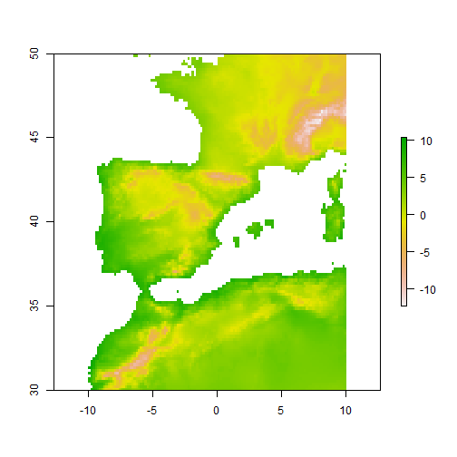 

```r

tmin.all.c <- crop(tmin.all, newext)
plot(tmin.all.c)
```

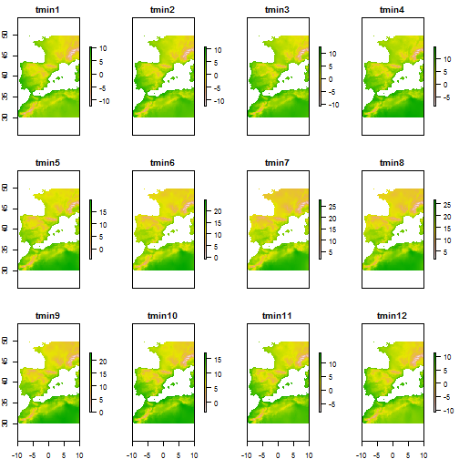 


DEFINE SPATIAL PROJECTION OF THE RASTERS
----------------------------------------


```r
crs.geo  # defined above
```

```
## CRS arguments:
##  +proj=longlat +ellps=WGS84 +datum=WGS84 +towgs84=0,0,0
```

```r
projection(tmin1.c) <- crs.geo
projection(tmin.all.c) <- crs.geo
tmin1.c  # notice info at coord.ref.
```

```
## class       : RasterLayer 
## dimensions  : 120, 120, 14400  (nrow, ncol, ncell)
## resolution  : 0.1667, 0.1667  (x, y)
## extent      : -10, 10, 30, 50  (xmin, xmax, ymin, ymax)
## coord. ref. : +proj=longlat +ellps=WGS84 +datum=WGS84 +towgs84=0,0,0 
## data source : in memory
## names       : layer 
## values      : -12.3, 10.3  (min, max)
```

```r


### CHANGING PROJECTION

tmin1.proj <- projectRaster(tmin1.c, crs = "+proj=merc +lon_0=0 +k=1 +x_0=0 +y_0=0 +a=6378137 +b=6378137 +units=m +no_defs")
tmin1.proj  # notice info at coord.ref.
```

```
## class       : RasterLayer 
## dimensions  : 131, 134, 17554  (nrow, ncol, ncell)
## resolution  : 18600, 24200  (x, y)
## extent      : -1243395, 1249005, 3397076, 6567276  (xmin, xmax, ymin, ymax)
## coord. ref. : +proj=merc +lon_0=0 +k=1 +x_0=0 +y_0=0 +a=6378137 +b=6378137 +units=m +no_defs 
## data source : in memory
## names       : layer 
## values      : -11.59, 10.3  (min, max)
```

```r
plot(tmin1.proj)
```

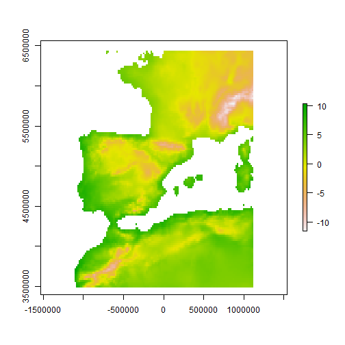 

```r
# can also use a template raster, see ?projectRaster
```


PLOTTING RASTER DATA
--------------------

Different plotting functions:

```r
histogram(tmin1.c)
```

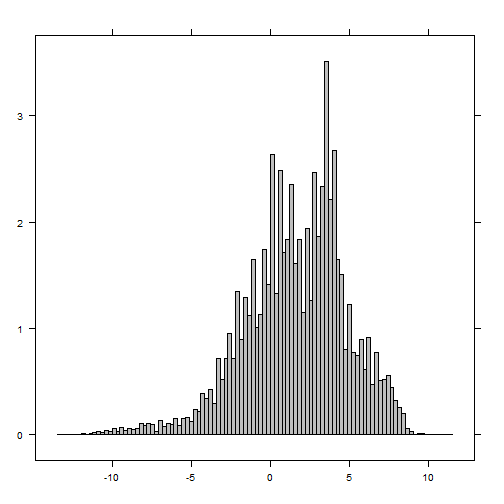 

```r
pairs(tmin.all.c)
```

 

```r
persp(tmin1.c)
```

 

```r
contour(tmin1.c)
```

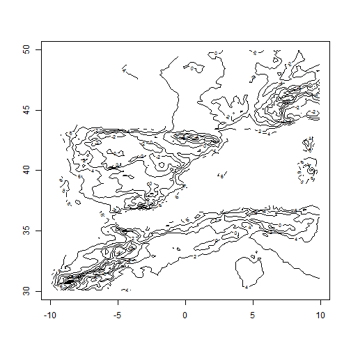 

```r
contourplot(tmin1.c)
```

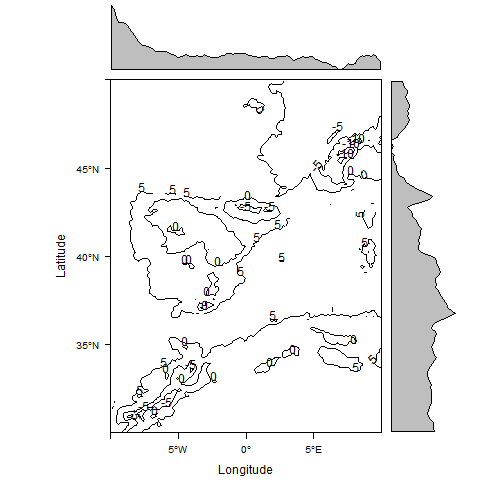 

```r
levelplot(tmin1.c)
```

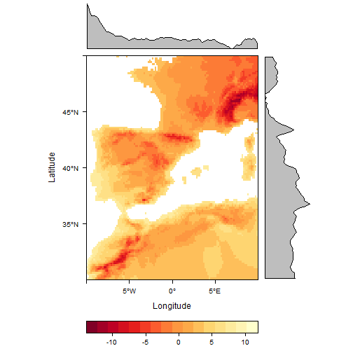 

```r
plot3D(tmin1.c)
```

```
## Loading required package: rgl
```

```r
bwplot(tmin.all.c)
```

 

```r
densityplot(tmin1.c)
```

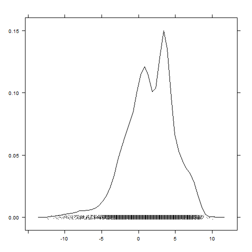 


Spatial autocorrelation
-----------------------


```r
Moran(tmin1.c)  # global Moran's I
```

```
## [1] 0.8985
```

```r
tmin1.Moran <- MoranLocal(tmin1.c)
plot(tmin1.Moran)
```

 


EXTRACT VALUES FROM RASTER
--------------------------


```r
head(locs)  # we'll obtain tmin values for our points
```

```
##   country
## 1      DE
## 2      IL
## 3      IL
## 4      IL
## 5      IL
## 6      IL
```

```r
projection(tmin1) <- crs.geo
locs$tmin1 <- extract(tmin1, locs)  # raster values are incorporated to the dataframe
head(locs)
```

```
##   country tmin1
## 1      DE  -3.6
## 2      IL   2.7
## 3      IL   7.3
## 4      IL   2.7
## 5      IL   2.7
## 6      IL   7.3
```


```r
# extract values for a given region
plot(tmin1.c)
reg.clim <- extract(tmin1.c, drawExtent())  # click twice to draw extent of the region of interest
summary(reg.clim)
```


```r
# rasterToPoints
tminvals <- rasterToPoints(tmin1.c)
head(tminvals)
```

```
##            x     y layer
## [1,] -6.4167 49.92   4.2
## [2,] -6.2500 49.92   4.2
## [3,] -5.2500 49.92   2.4
## [4,]  0.5833 49.92   1.0
## [5,]  0.7500 49.92   1.0
## [6,]  0.9167 49.92   1.0
```


```r
## CLICK function: get values from particular locations in the map
plot(tmin1.c)
click(tmin1.c, n = 3)  # click n times in the map
```


RASTERIZE POINTS, LINES OR POLYGONS
-----------------------------------


```r
locs2ras <- rasterize(locs.gb, tmin1)
locs2ras
```

```
## class       : RasterLayer 
## dimensions  : 900, 2160, 1944000  (nrow, ncol, ncell)
## resolution  : 0.1667, 0.1667  (x, y)
## extent      : -180, 180, -60, 90  (xmin, xmax, ymin, ymax)
## coord. ref. : +proj=longlat +ellps=WGS84 +datum=WGS84 +towgs84=0,0,0 
## data source : in memory
## names       : layer 
## values      : 3, 501  (min, max)
```

```r
plot(locs2ras, xlim = c(-10, 10), ylim = c(45, 60), legend = F)
data(wrld_simpl)
plot(wrld_simpl, add = T)
```

 


CHANGING RASTER RESOLUTION (aggregate)
--------------------------------------


```r
tmin1.lowres <- aggregate(tmin1.c, fact = 2, fun = mean)
tmin1.lowres
```

```
## class       : RasterLayer 
## dimensions  : 60, 60, 3600  (nrow, ncol, ncell)
## resolution  : 0.3333, 0.3333  (x, y)
## extent      : -10, 10, 30, 50  (xmin, xmax, ymin, ymax)
## coord. ref. : +proj=longlat +ellps=WGS84 +datum=WGS84 +towgs84=0,0,0 
## data source : in memory
## names       : layer 
## values      : -10.57, 10.1  (min, max)
```

```r
tmin1.c  # compare
```

```
## class       : RasterLayer 
## dimensions  : 120, 120, 14400  (nrow, ncol, ncell)
## resolution  : 0.1667, 0.1667  (x, y)
## extent      : -10, 10, 30, 50  (xmin, xmax, ymin, ymax)
## coord. ref. : +proj=longlat +ellps=WGS84 +datum=WGS84 +towgs84=0,0,0 
## data source : in memory
## names       : layer 
## values      : -12.3, 10.3  (min, max)
```

```r
par(mfcol = c(1, 2))
plot(tmin1.c, main = "original")
plot(tmin1.lowres, main = "low resolution")
```

 


SPLINE INTERPOLATION
--------------------


```r
xy <- data.frame(xyFromCell(tmin1.lowres, 1:ncell(tmin1.lowres)))  # get raster cell coordinates
head(xy)
```

```
##        x     y
## 1 -9.833 49.83
## 2 -9.500 49.83
## 3 -9.167 49.83
## 4 -8.833 49.83
## 5 -8.500 49.83
## 6 -8.167 49.83
```

```r
vals <- getValues(tmin1.lowres)
library(fields)
spline <- Tps(xy, vals)  # thin plate spline
intras <- interpolate(tmin1.c, spline)
intras  # note new resolution
```

```
## class       : RasterLayer 
## dimensions  : 120, 120, 14400  (nrow, ncol, ncell)
## resolution  : 0.1667, 0.1667  (x, y)
## extent      : -10, 10, 30, 50  (xmin, xmax, ymin, ymax)
## coord. ref. : +proj=longlat +ellps=WGS84 +datum=WGS84 +towgs84=0,0,0 
## data source : in memory
## names       : layer 
## values      : -10.43, 13.16  (min, max)
```

```r
plot(intras)
```

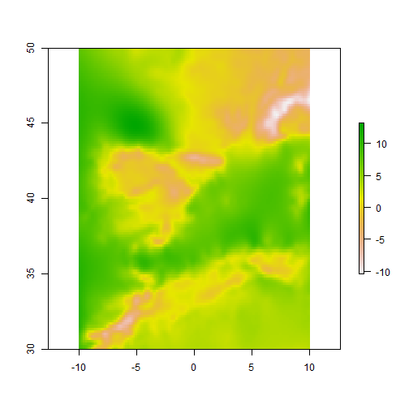 

```r
intras <- mask(intras, tmin1.c)  # mask to land areas only
plot(intras)
title("Interpolated raster")
```

 


SETTING ALL RASTERS TO THE SAME EXTENT, PROJECTION AND RESOLUTION ALL IN ONE
----------------------------------------------------------------------------


```r
library(climstats)
spatial_sync_raster
```


ELEVATIONS, SLOPE, ASPECT, ETC
------------------------------

Download elevation data from internet:

```r
elevation <- getData("alt", country = "ESP")
x <- terrain(elevation, opt = c("slope", "aspect"), unit = "degrees")
plot(x)
```

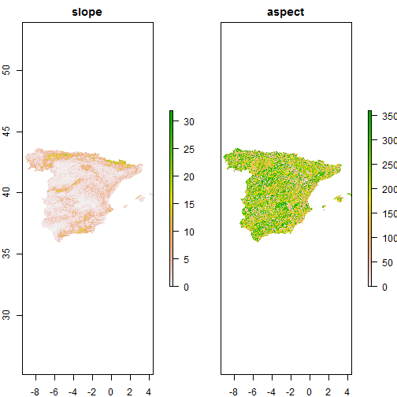 

```r

slope <- terrain(elevation, opt = "slope")
aspect <- terrain(elevation, opt = "aspect")
hill <- hillShade(slope, aspect, 40, 270)
plot(hill, col = grey(0:100/100), legend = FALSE, main = "Spain")
plot(elevation, col = rainbow(25, alpha = 0.35), add = TRUE)
```

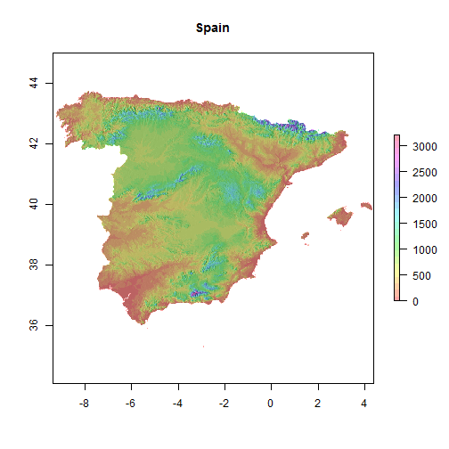 


SAVING AND EXPORTING RASTER DATA
--------------------------------

Saving raster to file:
----------------------

```r
writeRaster(tmin1.c, filename = "tmin1.c.grd")  # can export to many different file types, see help
```

```
## class       : RasterLayer 
## dimensions  : 120, 120, 14400  (nrow, ncol, ncell)
## resolution  : 0.1667, 0.1667  (x, y)
## extent      : -10, 10, 30, 50  (xmin, xmax, ymin, ymax)
## coord. ref. : +proj=longlat +ellps=WGS84 +datum=WGS84 +towgs84=0,0,0 
## data source : J:\R.scripts\my.Rcode\R-GIS tutorial\tmin1.c.grd 
## names       : layer 
## values      : -12.3, 10.3  (min, max)
```

```r
writeRaster(tmin.all.c, filename = "tmin.all.grd")
```

```
## class       : RasterBrick 
## dimensions  : 120, 120, 14400, 12  (nrow, ncol, ncell, nlayers)
## resolution  : 0.1667, 0.1667  (x, y)
## extent      : -10, 10, 30, 50  (xmin, xmax, ymin, ymax)
## coord. ref. : +proj=longlat +ellps=WGS84 +datum=WGS84 +towgs84=0,0,0 
## data source : J:\R.scripts\my.Rcode\R-GIS tutorial\tmin.all.grd 
## names       : tmin1, tmin2, tmin3, tmin4, tmin5, tmin6, tmin7, tmin8, tmin9, tmin10, tmin11, tmin12 
## min values  : -12.3, -12.5, -10.8,  -8.6,  -4.2,  -0.8,   1.8,   1.6,  -0.1,   -3.3,   -8.1,  -10.8 
## max values  :  10.3,  10.8,  12.5,  14.5,  19.7,  24.7,  27.6,  26.7,  22.9,   16.9,   13.7,   11.3
```


Exporting to KML (Google Earth)
-------------------------------

```r
tmin1.c <- raster(tmin.all.c, 1)
KML(tmin1.c, file = "tmin1.kml")
KML(tmin.all.c)  # can export multiple layers

```


SPATIAL STATISTICS
==================


Point pattern analysis
----------------------


Useful packages:


```r
library(spatial)
library(spatstat)
library(spatgraphs)
library(ecespa)  # ecological focus
# etc (see Spatial Task View:
# http://cran.r-project.org/web/views/Spatial.html)

# Example: Ripley's K
data(fig1)
plot(fig1)  # point pattern
```

 

```r
data(Helianthemum)
cosa12 <- K1K2(Helianthemum, j = "deadpl", i = "survpl", r = seq(0, 200, le = 201), 
    nsim = 99, nrank = 1, correction = "isotropic")
```

```
## 1, 2, 3, 4, 5, 6, 7, 8, 9, 10, 11, 12, 13, 14, 15,
## 16, 17, 18, 19, 20, 21, 22, 23, 24, 25, 26, 27, 28, 29, 30,
## 31, 32, 33, 34, 35, 36, 37, 38, 39, 40, 41, 42, 43, 44, 45,
## 46, 47, 48, 49, 50, 51, 52, 53, 54, 55, 56, 57, 58, 59, 60,
## 61, 62, 63, 64, 65, 66, 67, 68, 69, 70, 71, 72, 73, 74, 75,
## 76, 77, 78, 79, 80, 81, 82, 83, 84, 85, 86, 87, 88, 89, 90,
## 91, 92, 93, 94, 95, 96, 97, 98,  99.
```

```r
plot(cosa12$k1k2, lty = c(2, 1, 2), col = c(2, 1, 2), xlim = c(0, 200), main = "survival- death", 
    ylab = expression(K[1] - K[2]), legend = FALSE)
```

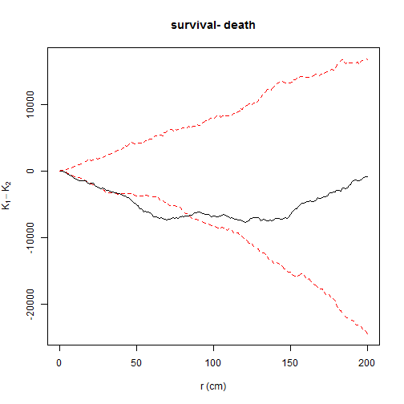 

```
##       lty col   key         label
## lo      2   2    lo         lo(r)
## K1-K2   1   1 K1-K2 K1(r) - K2(r)
## hi      2   2    hi         hi(r)
##                                                                               meaning
## lo                                            lower pointwise envelope of simulations
## K1-K2 differences of  Ripley isotropic correction estimate of expression(K[1] - K[2])
## hi                                            upper pointwise envelope of simulations
```


Geostatistics
-------------

Useful packages:


```r
library(gstat)
library(geoR)
library(akima)  # for spline interpolation
# etc (see Spatial Task View)

library(spdep)  # dealing with spatial dependence

```


INTERACTING AND COMMUNICATING WITH OTHER GIS
============================================


```r
library(spgrass6)  # GRASS
library(RPyGeo)  # ArcGis (Python)
library(RSAGA)  # SAGA
library(spsextante)  # Sextante

```


Other useful packages
=====================


```r
library(Metadata)  # automatically collates data from online GIS datasets (land cover, pop density, etc) for a given set of coordinates

# library(GeoXp) # Interactive exploratory spatial data analysis
example(columbus)
histomap(columbus, "CRIME")

library(maptools)
# readGPS

library(rangeMapper)  # plotting species distributions, richness and traits


# Species Distribution Modelling
library(dismo)
library(BIOMOD)
library(biomod2)
library(SDMTools)

library(BioCalc)  # computes 19 bioclimatic variables from monthly climatic values (tmin, tmax, prec)

```


To learn more
=============

Packages help and vignettes, especially

http://cran.r-project.org/web/packages/raster/vignettes/Raster.pdf   
http://cran.r-project.org/web/packages/dismo/vignettes/sdm.pdf   
http://cran.r-project.org/web/packages/sp/vignettes/sp.pdf   

CRAN Task View: Analysis of Spatial Data
http://cran.r-project.org/web/views/Spatial.html

R-SIG-Geo mailing list
https://stat.ethz.ch/mailman/listinfo/R-SIG-Geo

R wiki: tips for spatial data
http://rwiki.sciviews.org/doku.php?id=tips:spatial-data&s=spatial

book
http://www.asdar-book.org/  

R spatial tips: http://spatialanalysis.co.uk/r/   
  
http://spatial-analyst.net   


