Spatial data in R: Using R as a GIS     
========================================================


A tutorial to perform basic operations with spatial data in R, such as importing and exporting data (both vectorial and raster), plotting, analysing and making maps.


[Francisco Rodriguez-Sanchez](http://sites.google.com/site/rodriguezsanchezf) 


v 2.2  

27-01-2015 

Licence: [CC BY 4.0](http://creativecommons.org/licenses/by/4.0/)


Check out code and latest version at [GitHub](https://github.com/Pakillo/R-GIS-tutorial/blob/master/R-GIS_tutorial.md)


<br>
<br>
<br>

CONTENTS <a name="contents"></a>
=========

<br>
<br>

[1. INTRODUCTION](#intro)
<br>
<br>


[2. GENERIC MAPPING](#mapping)
<br>
  
  * [Retrieving base maps from Google with `gmap` function in package `dismo`](#gmap)
  
  * [`RgoogleMaps`: Map your data onto Google Map tiles](#rgooglemaps)
  
  * [`googleVis`: visualise data in a web browser using Google Visualisation API](#googlevis)
  
  * [`RWorldMap`: mapping global data](#rworldmap)
<br>
<br>


[3. SPATIAL VECTOR DATA (points, lines, polygons)](#vector)
<br>

  * [Example dataset: retrieve point occurrence data from GBIF](#gbif)
  
  * [Making data 'spatial'](#spatial)
  
  * [Define spatial projection](#projection)
  
  * [Quickly plotting point data on a map](#plot)
  
  * [Subsetting and mapping again](#subset)
  
  * [Mapping vectorial data (points, polygons, polylines)](#mapvector)
  
  * [Drawing polygons and polylines (e.g. for digitising)](#digitise)
  
  * [Converting between formats, reading in, and saving spatial vector data](#iovec)
  
  * [Changing projection of spatial vector data](#changeproj)
<br>
<br>
  
  
[4. USING RASTER (GRID) DATA](#raster)
<br>

  * [Downloading raster climate data from internet](#getdata)
  
  * [Loading a raster layer](#loadraster)
  
  * [Creating a raster stack](#rasterstack)
  
  * [Raster bricks](#rasterbrick)
  
  * [Crop rasters](#cropraster)
  
  * [Define spatial projection of the rasters](#projectionraster)
  
  * [Changing projection](#changeprojraster)
  
  * [Plotting raster data](#plotraster)
  
  * [Spatial autocorrelation](#autocorrelation)
  
  * [Extract values from raster](#extract)
  
  * [Rasterize vector data (points, lines or polygons)](#rasterize)
  
  * [Changing raster resolution](#resolution)
  
  * [Spline interpolation](#interpolation)
  
  * [Setting all rasters to the same extent, projection and resolution all in one](#spatialsync)
  
  * [Elevations, slope, aspect, etc](#elevation)
  
  * [Saving and exporting raster data](#saveraster)
<br>
<br>


[5. SPATIAL STATISTICS](#spatstats)
<br>

  * [Point pattern analysis](#pointpatterns)
  
  * [Geostatistics](#geostatistics)
<br> 
<br>

  
  
[6. INTERACTING WITH OTHER GIS](#othergis)
<br>
<br>

[7. OTHER USEFUL PACKAGES](#otherpackages)
<br>
<br>

[8. TO LEARN MORE](#tolearnmore)


<br>
<br>
<br>
<br>


1. INTRODUCTION <a name="intro"></a>
===============

<br>

R is great not only for doing statistics, but also for many other tasks, including GIS analysis and working with spatial data. For instance, R is capable of doing wonderful maps such as [this](http://spatialanalysis.co.uk/wp-content/uploads/2012/02/bike_ggplot.png) or [this](http://oscarperpinan.github.io/spacetime-vis/images/airMadrid_stamen.png). In this tutorial I will show some basic GIS functionality in R.


#### Basic packages


```r

library(sp)  # classes for spatial data
library(raster)  # grids, rasters
library(rasterVis)  # raster visualisation
library(maptools)
library(rgeos)
# and their dependencies
```


There are many other useful packages, e.g. check [CRAN Spatial Task View](http://cran.r-project.org/web/views/Spatial.html). Some of them will be used below.

<br>
[Back to Contents](#contents)
<br>
<br>
<br>
<br>


     
2. GENERIC MAPPING <a name="mapping"></a>
==================

<br>


Retrieving base maps from Google with `gmap` function in package `dismo` <a name="gmap"></a>
------------------------------------------------------------------------

Some examples:

Getting maps for countries:


```r

library(dismo)

mymap <- gmap("France")  # choose whatever country
plot(mymap)
```

  


Choose map type:

```r
mymap <- gmap("France", type = "satellite")
plot(mymap)
```

 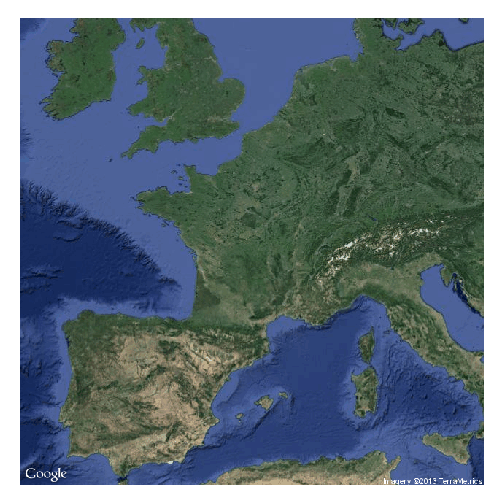 


Choose zoom level:

```r
mymap <- gmap("France", type = "satellite", exp = 3)
plot(mymap)
```

 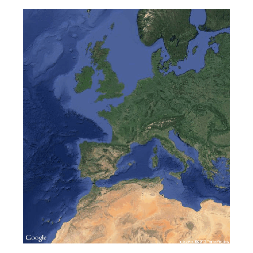 


Save the map as a file in your working directory for future use

```r
mymap <- gmap("France", type = "satellite", filename = "France.gmap")
```


Now get a map for a region drawn at hand


```r

mymap <- gmap("Europe")
plot(mymap)

select.area <- drawExtent()
# now click 2 times on the map to select your region
mymap <- gmap(select.area)
plot(mymap)
# See ?gmap for many other possibilities
```


<br>
<br>


`RgoogleMaps`: Map your data onto Google Map tiles <a name="rgooglemaps"></a>
------------------------------------------------


```r
library(RgoogleMaps)
```


Get base maps from Google (a file will be saved in your working directory)

```r
newmap <- GetMap(center = c(36.7, -5.9), zoom = 10, destfile = "newmap.png", 
    maptype = "satellite")

# Now using bounding box instead of center coordinates:
newmap2 <- GetMap.bbox(lonR = c(-5, -6), latR = c(36, 37), destfile = "newmap2.png", 
    maptype = "terrain")

# Try different maptypes
newmap3 <- GetMap.bbox(lonR = c(-5, -6), latR = c(36, 37), destfile = "newmap3.png", 
    maptype = "satellite")
```


Now plot data onto these maps, e.g. these 3 points

```r
PlotOnStaticMap(lat = c(36.3, 35.8, 36.4), lon = c(-5.5, -5.6, -5.8), zoom = 10, 
    cex = 4, pch = 19, col = "red", FUN = points, add = F)
```

 


<br>
<br>


`googleVis`: visualise data in a web browser using Google Visualisation API <a name="googlevis"></a>
---------------------------------------------------------------------------


```r
library(googleVis)
```


Run `demo(googleVis)` to see all the possibilities


<br>

### Example: plot country-level data

```r
data(Exports)    # a simple data frame
Geo <- gvisGeoMap(Exports, locationvar="Country", numvar="Profit", 
                  options=list(height=400, dataMode='regions'))
plot(Geo)
```

<!-- GeoMap generated in R 3.0.2 by googleVis 0.4.7 package -->
<!-- Thu Dec 19 12:27:31 2013 -->


<!-- jsHeader -->
<script type="text/javascript">
 
// jsData 
function gvisDataGeoMapIDb083e32714a () {
var data = new google.visualization.DataTable();
var datajson =
[
 [
 "Germany",
3 
],
[
 "Brazil",
4 
],
[
 "United States",
5 
],
[
 "France",
4 
],
[
 "Hungary",
3 
],
[
 "India",
2 
],
[
 "Iceland",
1 
],
[
 "Norway",
4 
],
[
 "Spain",
5 
],
[
 "Turkey",
1 
] 
];
data.addColumn('string','Country');
data.addColumn('number','Profit');
data.addRows(datajson);
return(data);
}
 
// jsDrawChart
function drawChartGeoMapIDb083e32714a() {
var data = gvisDataGeoMapIDb083e32714a();
var options = {};
options["dataMode"] = "regions";
options["width"] =    556;
options["height"] =    400;

    var chart = new google.visualization.GeoMap(
    document.getElementById('GeoMapIDb083e32714a')
    );
    chart.draw(data,options);
    

}
  
 
// jsDisplayChart
(function() {
var pkgs = window.__gvisPackages = window.__gvisPackages || [];
var callbacks = window.__gvisCallbacks = window.__gvisCallbacks || [];
var chartid = "geomap";
  
// Manually see if chartid is in pkgs (not all browsers support Array.indexOf)
var i, newPackage = true;
for (i = 0; newPackage && i < pkgs.length; i++) {
if (pkgs[i] === chartid)
newPackage = false;
}
if (newPackage)
  pkgs.push(chartid);
  
// Add the drawChart function to the global list of callbacks
callbacks.push(drawChartGeoMapIDb083e32714a);
})();
function displayChartGeoMapIDb083e32714a() {
  var pkgs = window.__gvisPackages = window.__gvisPackages || [];
  var callbacks = window.__gvisCallbacks = window.__gvisCallbacks || [];
  window.clearTimeout(window.__gvisLoad);
  // The timeout is set to 100 because otherwise the container div we are
  // targeting might not be part of the document yet
  window.__gvisLoad = setTimeout(function() {
  var pkgCount = pkgs.length;
  google.load("visualization", "1", { packages:pkgs, callback: function() {
  if (pkgCount != pkgs.length) {
  // Race condition where another setTimeout call snuck in after us; if
  // that call added a package, we must not shift its callback
  return;
}
while (callbacks.length > 0)
callbacks.shift()();
} });
}, 100);
}
 
// jsFooter
</script>
 
<!-- jsChart -->  
<script type="text/javascript" src="https://www.google.com/jsapi?callback=displayChartGeoMapIDb083e32714a"></script>
 
<!-- divChart -->
  
<div id="GeoMapIDb083e32714a"
  style="width: 556px; height: 400px;">
</div>

Using `print(Geo)` we can get the HTML code to embed the map in a web page!

<br>

### Example: Plotting point data onto a google map (internet)

```r
data(Andrew)
M1 <- gvisMap(Andrew, "LatLong", "Tip", 
              options=list(showTip=TRUE, showLine=F, enableScrollWheel=TRUE, 
                           mapType='satellite', useMapTypeControl=TRUE, width=800,height=400))
plot(M1)
```

<!-- Map generated in R 3.0.2 by googleVis 0.4.7 package -->
<!-- Thu Dec 19 12:27:31 2013 -->


<!-- jsHeader -->
<script type="text/javascript">
 
// jsData 
function gvisDataMapIDb08491aa1 () {
var data = new google.visualization.DataTable();
var datajson =
[
 [
 10.8,
-35.5,
"Tropical Depression<BR>Pressure=1010<BR>Speed=25" 
],
[
 11.2,
-37.4,
"Tropical Depression<BR>Pressure=1009<BR>Speed=30" 
],
[
 11.7,
-39.6,
"Tropical Depression<BR>Pressure=1008<BR>Speed=30" 
],
[
 12.3,
-42,
"Tropical Storm<BR>Pressure=1006<BR>Speed=35" 
],
[
 13.1,
-44.2,
"Tropical Storm<BR>Pressure=1003<BR>Speed=35" 
],
[
 13.6,
-46.2,
"Tropical Storm<BR>Pressure=1002<BR>Speed=40" 
],
[
 14.1,
-48,
"Tropical Storm<BR>Pressure=1001<BR>Speed=45" 
],
[
 14.6,
-49.9,
"Tropical Storm<BR>Pressure=1000<BR>Speed=45" 
],
[
 15.4,
-51.8,
"Tropical Storm<BR>Pressure=1000<BR>Speed=45" 
],
[
 16.3,
-53.5,
"Tropical Storm<BR>Pressure=1001<BR>Speed=45" 
],
[
 17.2,
-55.3,
"Tropical Storm<BR>Pressure=1002<BR>Speed=45" 
],
[
 18,
-56.9,
"Tropical Storm<BR>Pressure=1005<BR>Speed=45" 
],
[
 18.8,
-58.3,
"Tropical Storm<BR>Pressure=1007<BR>Speed=45" 
],
[
 19.8,
-59.3,
"Tropical Storm<BR>Pressure=1011<BR>Speed=40" 
],
[
 20.7,
-60,
"Tropical Storm<BR>Pressure=1013<BR>Speed=40" 
],
[
 21.7,
-60.7,
"Tropical Storm<BR>Pressure=1015<BR>Speed=40" 
],
[
 22.5,
-61.5,
"Tropical Storm<BR>Pressure=1014<BR>Speed=40" 
],
[
 23.2,
-62.4,
"Tropical Storm<BR>Pressure=1014<BR>Speed=45" 
],
[
 23.9,
-63.3,
"Tropical Storm<BR>Pressure=1010<BR>Speed=45" 
],
[
 24.4,
-64.2,
"Tropical Storm<BR>Pressure=1007<BR>Speed=50" 
],
[
 24.8,
-64.9,
"Tropical Storm<BR>Pressure=1004<BR>Speed=50" 
],
[
 25.3,
-65.9,
"Tropical Storm<BR>Pressure=1000<BR>Speed=55" 
],
[
 25.6,
-67,
"Tropical Storm<BR>Pressure=994<BR>Speed=60" 
],
[
 25.8,
-68.3,
"Hurricane<BR>Pressure=981<BR>Speed=70" 
],
[
 25.7,
-69.7,
"Hurricane<BR>Pressure=969<BR>Speed=80" 
],
[
 25.6,
-71.1,
"Hurricane<BR>Pressure=961<BR>Speed=90" 
],
[
 25.5,
-72.5,
"Hurricane<BR>Pressure=947<BR>Speed=105" 
],
[
 25.4,
-74.2,
"Hurricane<BR>Pressure=933<BR>Speed=120" 
],
[
 25.4,
-75.8,
"Hurricane<BR>Pressure=922<BR>Speed=135" 
],
[
 25.4,
-77.5,
"Hurricane<BR>Pressure=930<BR>Speed=125" 
],
[
 25.4,
-79.3,
"Hurricane<BR>Pressure=937<BR>Speed=120" 
],
[
 25.6,
-81.2,
"Hurricane<BR>Pressure=951<BR>Speed=110" 
],
[
 25.8,
-83.1,
"Hurricane<BR>Pressure=947<BR>Speed=115" 
],
[
 26.2,
-85,
"Hurricane<BR>Pressure=943<BR>Speed=115" 
],
[
 26.6,
-86.7,
"Hurricane<BR>Pressure=948<BR>Speed=115" 
],
[
 27.2,
-88.2,
"Hurricane<BR>Pressure=946<BR>Speed=115" 
],
[
 27.8,
-89.6,
"Hurricane<BR>Pressure=941<BR>Speed=120" 
],
[
 28.5,
-90.5,
"Hurricane<BR>Pressure=937<BR>Speed=120" 
],
[
 29.2,
-91.3,
"Hurricane<BR>Pressure=955<BR>Speed=115" 
],
[
 30.1,
-91.7,
"Tropical Storm<BR>Pressure=973<BR>Speed=80" 
],
[
 30.9,
-91.6,
"Tropical Storm<BR>Pressure=991<BR>Speed=50" 
],
[
 31.5,
-91.1,
"Tropical Depression<BR>Pressure=995<BR>Speed=35" 
],
[
 32.1,
-90.5,
"Tropical Depression<BR>Pressure=997<BR>Speed=30" 
],
[
 32.8,
-89.6,
"Tropical Depression<BR>Pressure=998<BR>Speed=30" 
],
[
 33.6,
-88.4,
"Tropical Depression<BR>Pressure=999<BR>Speed=25" 
],
[
 34.4,
-86.7,
"Tropical Depression<BR>Pressure=1000<BR>Speed=20" 
],
[
 35.4,
-84,
"Tropical Depression<BR>Pressure=1000<BR>Speed=20" 
] 
];
data.addColumn('number','Latitude');
data.addColumn('number','Longitude');
data.addColumn('string','Tip');
data.addRows(datajson);
return(data);
}
 
// jsDrawChart
function drawChartMapIDb08491aa1() {
var data = gvisDataMapIDb08491aa1();
var options = {};
options["showTip"] = true;
options["showLine"] = false;
options["enableScrollWheel"] = true;
options["mapType"] = "satellite";
options["useMapTypeControl"] = true;
options["width"] =    800;
options["height"] =    400;

    var chart = new google.visualization.Map(
    document.getElementById('MapIDb08491aa1')
    );
    chart.draw(data,options);
    

}
  
 
// jsDisplayChart
(function() {
var pkgs = window.__gvisPackages = window.__gvisPackages || [];
var callbacks = window.__gvisCallbacks = window.__gvisCallbacks || [];
var chartid = "map";
  
// Manually see if chartid is in pkgs (not all browsers support Array.indexOf)
var i, newPackage = true;
for (i = 0; newPackage && i < pkgs.length; i++) {
if (pkgs[i] === chartid)
newPackage = false;
}
if (newPackage)
  pkgs.push(chartid);
  
// Add the drawChart function to the global list of callbacks
callbacks.push(drawChartMapIDb08491aa1);
})();
function displayChartMapIDb08491aa1() {
  var pkgs = window.__gvisPackages = window.__gvisPackages || [];
  var callbacks = window.__gvisCallbacks = window.__gvisCallbacks || [];
  window.clearTimeout(window.__gvisLoad);
  // The timeout is set to 100 because otherwise the container div we are
  // targeting might not be part of the document yet
  window.__gvisLoad = setTimeout(function() {
  var pkgCount = pkgs.length;
  google.load("visualization", "1", { packages:pkgs, callback: function() {
  if (pkgCount != pkgs.length) {
  // Race condition where another setTimeout call snuck in after us; if
  // that call added a package, we must not shift its callback
  return;
}
while (callbacks.length > 0)
callbacks.shift()();
} });
}, 100);
}
 
// jsFooter
</script>
 
<!-- jsChart -->  
<script type="text/javascript" src="https://www.google.com/jsapi?callback=displayChartMapIDb08491aa1"></script>
 
<!-- divChart -->
  
<div id="MapIDb08491aa1"
  style="width: 800px; height: 400px;">
</div>


  
    
<br>
<br>


`RWorldMap`: mapping global data <a name="rworldmap"></a>
--------------------------------

Some examples


```r

library(rworldmap)

newmap <- getMap(resolution = "coarse")  # different resolutions available
plot(newmap)
```

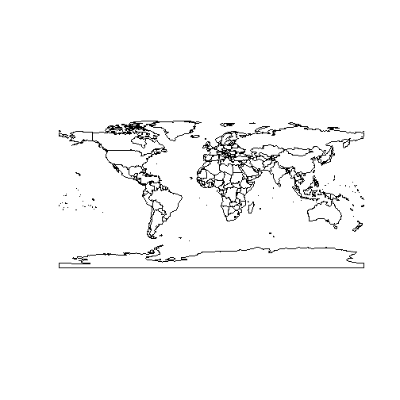 


```r
mapCountryData()
```

 


```r
mapCountryData(mapRegion = "europe")
```

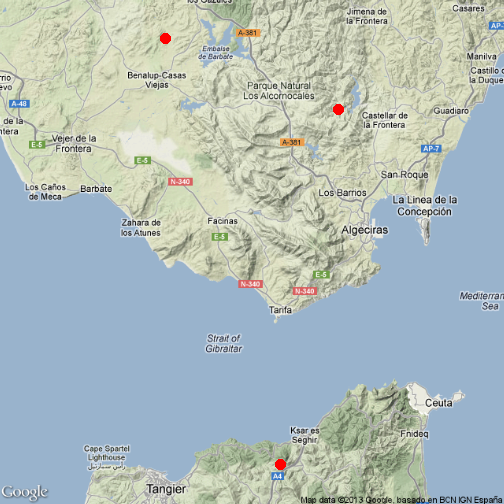 


```r
mapGriddedData()
```

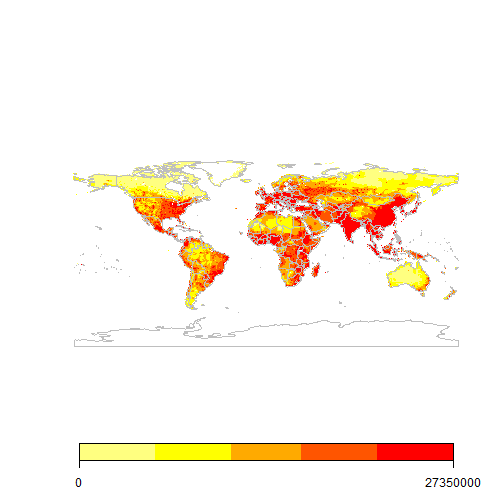 


```r
mapGriddedData(mapRegion = "europe")
```

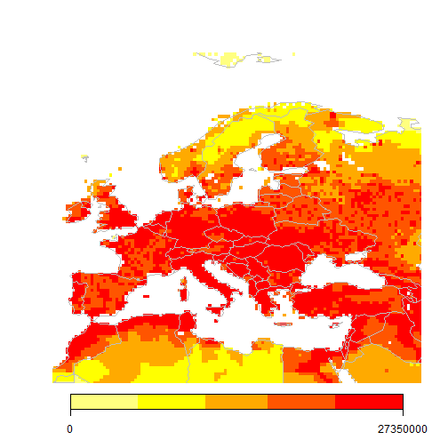 


<br>
[Back to Contents](#contents)
<br>
<br>
<br>
<br>
<br>
    


  
   


3. SPATIAL VECTOR DATA (points, lines, polygons) <a name="vector"></a>
================================================

<br>
<br>

### Example dataset: retrieve point occurrence data from GBIF <a name="gbif"></a>

Let's create an example dataset: retrieve occurrence data 
for the laurel tree (Laurus nobilis) from the 
[Global Biodiversity Information Facility (GBIF)](http://gbif.org)

```r
library(dismo)  # check also the nice 'rgbif' package! 
laurus <- gbif("Laurus", "nobilis")
```

```
## Laurus nobilis : 2120 occurrences found
## 1-1000-2000-2120
```

```r
# get data frame with spatial coordinates (points)
locs <- subset(laurus, select = c("country", "lat", "lon"))
head(locs)  # a simple data frame with coordinates
```

```
##   country   lat    lon
## 1   Spain 36.12 -5.579
## 2   Spain 38.26 -5.207
## 3   Spain 36.11 -5.534
## 4   Spain 36.87 -5.312
## 5   Spain 37.30 -1.918
## 6   Spain 36.10 -5.545
```

```r

# Discard data with errors in coordinates:
locs <- subset(locs, locs$lat < 90)
```


<br>

### Making data 'spatial' <a name="spatial"></a>

So we have got a simple dataframe containing spatial coordinates. 
Let's make these data explicitly *spatial*

```r
coordinates(locs) <- c("lon", "lat")  # set spatial coordinates
plot(locs)
```

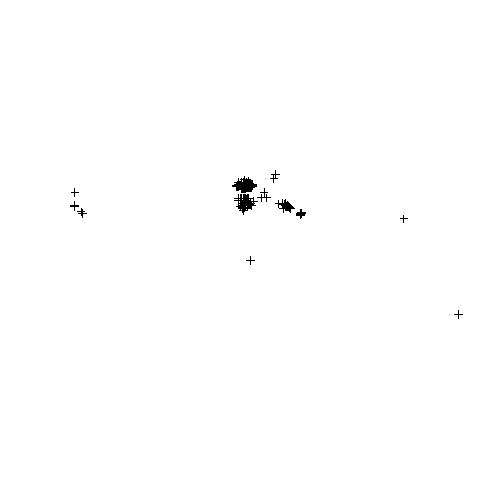 


### Define spatial projection <a name="projection"></a>

Important: define geographical projection. 
Consult the appropriate PROJ.4 description here: 
[http://www.spatialreference.org/](http://www.spatialreference.org/)

```r
crs.geo <- CRS("+proj=longlat +ellps=WGS84 +datum=WGS84")  # geographical, datum WGS84
proj4string(locs) <- crs.geo  # define projection system of our data
summary(locs)
```

```
## Object of class SpatialPointsDataFrame
## Coordinates:
##         min    max
## lon -123.25 145.04
## lat  -37.78  59.84
## Is projected: FALSE 
## proj4string :
## [+proj=longlat +ellps=WGS84 +datum=WGS84 +towgs84=0,0,0]
## Number of points: 2109
## Data attributes:
##    Length     Class      Mode 
##      2109 character character
```


<br>

### Quickly plotting point data on a map <a name="plot"></a>

```r
plot(locs, pch = 20, col = "steelblue")
library(rworldmap)
# library rworldmap provides different types of global maps, e.g:
data(coastsCoarse)
data(countriesLow)
plot(coastsCoarse, add = T)
```

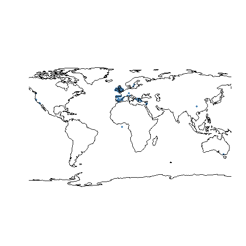 


### Subsetting and mapping again <a name="subset"></a>

```r
table(locs$country)  # see localities of Laurus nobilis by country
```

```
## 
##      Australia         Canada        Croatia         France        Germany 
##              2              1              1              1              1 
##         Greece        Ireland         Israel          Italy          Spain 
##              5             69           1231              2            206 
##         Sweden United Kingdom  United States 
##              2            578             10
```

```r

locs.gb <- subset(locs, locs$country == "United Kingdom")  # select only locs in UK
plot(locs.gb, pch = 20, cex = 2, col = "steelblue")
title("Laurus nobilis occurrences in UK")
plot(countriesLow, add = T)
```

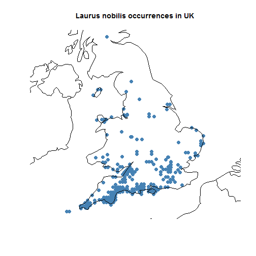 

```r
summary(locs.gb)
```

```
## Object of class SpatialPointsDataFrame
## Coordinates:
##        min    max
## lon -6.392  1.772
## lat 49.951 56.221
## Is projected: FALSE 
## proj4string :
## [+proj=longlat +ellps=WGS84 +datum=WGS84 +towgs84=0,0,0]
## Number of points: 578
## Data attributes:
##    Length     Class      Mode 
##       578 character character
```


<br>

Mapping vectorial data (points, polygons, polylines) <a name="mapvector"></a>
---------------------------------------------------------------------

<br>

### Mapping vectorial data using `gmap` from `dismo`


```r
gbmap <- gmap(locs.gb, type = "satellite")
locs.gb.merc <- Mercator(locs.gb)  # Google Maps are in Mercator projection. 
# This function projects the points to that projection to enable mapping
plot(gbmap)
```

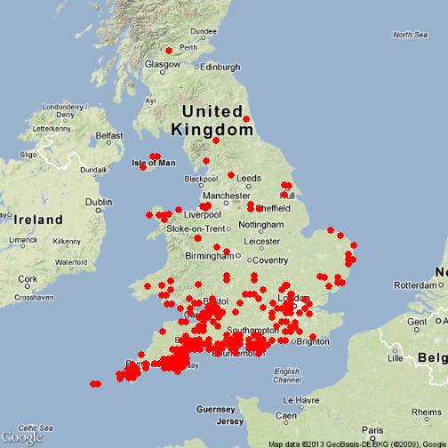 

```r
points(locs.gb.merc, pch = 20, col = "red")
```

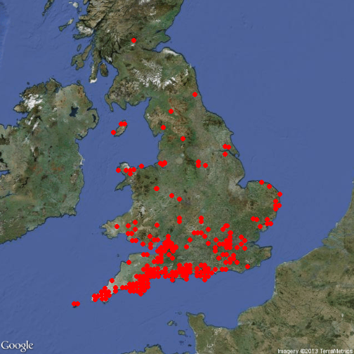 


<br>

### Mapping vectorial data with `RgoogleMaps` 


```r

require(RgoogleMaps)

locs.gb.coords <- as.data.frame(coordinates(locs.gb))  # retrieves coordinates 
# (1st column for longitude, 2nd column for latitude)
PlotOnStaticMap(lat = locs.gb.coords$lat, lon = locs.gb.coords$lon, zoom = 5, 
    cex = 1.4, pch = 19, col = "red", FUN = points, add = F)
```

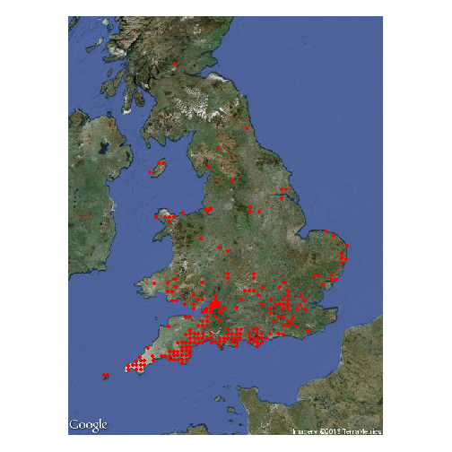 


Download base map from Google Maps and plot onto it

```r
map.lim <- qbbox(locs.gb.coords$lat, locs.gb.coords$lon, TYPE = "all")  # define region 
# of interest (bounding box)
mymap <- GetMap.bbox(map.lim$lonR, map.lim$latR, destfile = "gmap.png", maptype = "satellite")
```

```
## [1] "http://maps.google.com/maps/api/staticmap?center=53.086237,-2.30987445&zoom=6&size=640x640&maptype=satellite&format=png32&sensor=true"
```

```r
# see the file in the wd
PlotOnStaticMap(mymap, lat = locs.gb.coords$lat, lon = locs.gb.coords$lon, zoom = NULL, 
    cex = 1.3, pch = 19, col = "red", FUN = points, add = F)
```

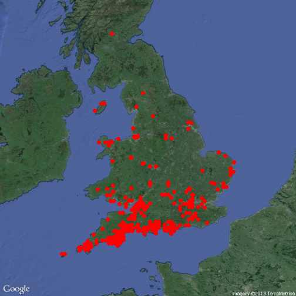 


<br>
<br>

Using different background (base map)

```r
mymap <- GetMap.bbox(map.lim$lonR, map.lim$latR, destfile = "gmap.png", maptype = "hybrid")
```

```
## [1] "http://maps.google.com/maps/api/staticmap?center=53.086237,-2.30987445&zoom=6&size=640x640&maptype=hybrid&format=png32&sensor=true"
```

```r
PlotOnStaticMap(mymap, lat = locs.gb.coords$lat, lon = locs.gb.coords$lon, zoom = NULL, 
    cex = 1.3, pch = 19, col = "red", FUN = points, add = F)
```

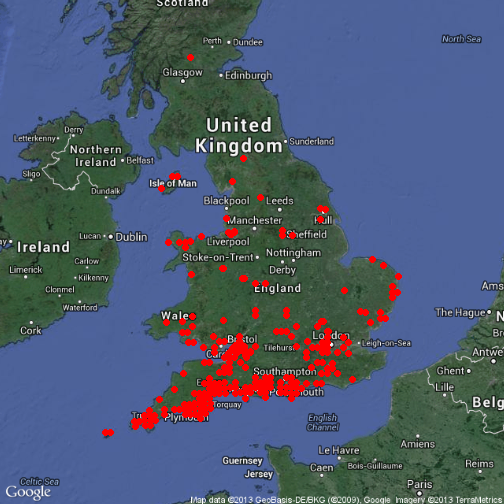 


<br>
<br>

### Map vectorial data with `googleVis` (internet) 


```r
points.gb <- as.data.frame(locs.gb)
points.gb$latlon <- paste(points.gb$lat, points.gb$lon, sep=":")
map.gb <- gvisMap(points.gb, locationvar="latlon", tipvar="country", 
                  options = list(showTip=T, showLine=F, enableScrollWheel=TRUE,
                           useMapTypeControl=T, width=1400,height=800))
plot(map.gb)
```

<!-- Map generated in R 3.0.2 by googleVis 0.4.7 package -->
<!-- Thu Dec 19 12:28:17 2013 -->


<!-- jsHeader -->
<script type="text/javascript">
 
// jsData 
function gvisDataMapIDb085424efa () {
var data = new google.visualization.DataTable();
var datajson =
[
 [
 53.798363,
-0.25377846,
"United Kingdom" 
],
[
 53.800476,
-0.40555596,
"United Kingdom" 
],
[
 53.41154,
-2.9779854,
"United Kingdom" 
],
[
 53.412884,
-2.7974555,
"United Kingdom" 
],
[
 53.430862,
-2.797792,
"United Kingdom" 
],
[
 53.412884,
-2.7974555,
"United Kingdom" 
],
[
 50.66304,
-1.5047381,
"United Kingdom" 
],
[
 50.66046,
-1.0802728,
"United Kingdom" 
],
[
 51.287277,
-0.7809699,
"United Kingdom" 
],
[
 50.75039,
-1.0785117,
"United Kingdom" 
],
[
 50.257538,
-5.297342,
"United Kingdom" 
],
[
 50.66046,
-1.0802728,
"United Kingdom" 
],
[
 51.967426,
1.2758358,
"United Kingdom" 
],
[
 50.175335,
-5.011484,
"United Kingdom" 
],
[
 51.194042,
-3.502832,
"United Kingdom" 
],
[
 52.962803,
1.0527366,
"United Kingdom" 
],
[
 51.46179,
-0.34441733,
"United Kingdom" 
],
[
 52.672245,
1.7722985,
"United Kingdom" 
],
[
 50.752285,
-1.3620236,
"United Kingdom" 
],
[
 51.194042,
-3.502832,
"United Kingdom" 
],
[
 51.28868,
-3.0756438,
"United Kingdom" 
],
[
 51.651524,
-2.6505208,
"United Kingdom" 
],
[
 50.751423,
-1.2202638,
"United Kingdom" 
],
[
 52.057198,
1.282405,
"United Kingdom" 
],
[
 50.752285,
-1.3620236,
"United Kingdom" 
],
[
 50.66149,
-1.2217541,
"United Kingdom" 
],
[
 52.06857,
0.8453797,
"United Kingdom" 
],
[
 50.75039,
-2.9214883,
"United Kingdom" 
],
[
 50.751423,
-1.2202638,
"United Kingdom" 
],
[
 50.66149,
-1.2217541,
"United Kingdom" 
],
[
 50.175335,
-5.011484,
"United Kingdom" 
],
[
 51.194042,
-3.502832,
"United Kingdom" 
],
[
 50.293114,
-3.6146727,
"United Kingdom" 
],
[
 52.4974,
1.6098989,
"United Kingdom" 
],
[
 51.18774,
-0.06802027,
"United Kingdom" 
],
[
 52.440582,
0.2806388,
"United Kingdom" 
],
[
 50.66304,
-1.5047381,
"United Kingdom" 
],
[
 50.571564,
-1.2232367,
"United Kingdom" 
],
[
 50.159473,
-5.570697,
"United Kingdom" 
],
[
 51.194042,
-3.502832,
"United Kingdom" 
],
[
 54.25755,
-2.8443713,
"United Kingdom" 
],
[
 50.751423,
-1.2202638,
"United Kingdom" 
],
[
 50.84135,
-2.781234,
"United Kingdom" 
],
[
 50.571564,
-1.2232367,
"United Kingdom" 
],
[
 50.751423,
-1.2202638,
"United Kingdom" 
],
[
 50.84135,
-1.218766,
"United Kingdom" 
],
[
 50.84135,
-1.218766,
"United Kingdom" 
],
[
 50.751423,
-1.2202638,
"United Kingdom" 
],
[
 52.40767,
1.6025597,
"United Kingdom" 
],
[
 50.83772,
-0.7927215,
"United Kingdom" 
],
[
 50.159473,
-5.570697,
"United Kingdom" 
],
[
 51.96329,
1.4211539,
"United Kingdom" 
],
[
 50.752285,
-1.3620236,
"United Kingdom" 
],
[
 50.069702,
-5.5640182,
"United Kingdom" 
],
[
 50.75039,
-1.0785117,
"United Kingdom" 
],
[
 50.65634,
-3.344112,
"United Kingdom" 
],
[
 51.108856,
-3.0714636,
"United Kingdom" 
],
[
 50.75039,
-1.0785117,
"United Kingdom" 
],
[
 53.376064,
-2.9170372,
"United Kingdom" 
],
[
 53.376293,
-2.8869743,
"United Kingdom" 
],
[
 52.55246,
-1.926249,
"United Kingdom" 
],
[
 53.358746,
-1.1735004,
"United Kingdom" 
],
[
 53.358746,
-1.1735004,
"United Kingdom" 
],
[
 53.358746,
-1.1735004,
"United Kingdom" 
],
[
 53.358746,
-1.1735004,
"United Kingdom" 
],
[
 51.74144,
-1.3481886,
"United Kingdom" 
],
[
 50.538197,
-4.893384,
"United Kingdom" 
],
[
 50.069702,
-5.5640182,
"United Kingdom" 
],
[
 50.933704,
-1.7865157,
"United Kingdom" 
],
[
 50.75039,
-2.9214883,
"United Kingdom" 
],
[
 51.561604,
-2.6492372,
"United Kingdom" 
],
[
 51.108856,
-3.0714636,
"United Kingdom" 
],
[
 50.652733,
-3.6269717,
"United Kingdom" 
],
[
 50.538197,
-4.893384,
"United Kingdom" 
],
[
 50.538197,
-4.893384,
"United Kingdom" 
],
[
 50.538197,
-4.893384,
"United Kingdom" 
],
[
 54.618816,
-2.5420728,
"United Kingdom" 
],
[
 52.012802,
-2.2185814,
"United Kingdom" 
],
[
 51.471687,
-2.64796,
"United Kingdom" 
],
[
 50.83772,
-0.7927215,
"United Kingdom" 
],
[
 50.751423,
-2.7797363,
"United Kingdom" 
],
[
 50.463715,
-4.1841645,
"United Kingdom" 
],
[
 50.538197,
-4.893384,
"United Kingdom" 
],
[
 49.956474,
-6.2530303,
"United Kingdom" 
],
[
 50.383022,
-3.6177242,
"United Kingdom" 
],
[
 53.24907,
-4.323423,
"United Kingdom" 
],
[
 51.20192,
-2.6441677,
"United Kingdom" 
],
[
 51.892365,
-4.6888576,
"United Kingdom" 
],
[
 51.742153,
-1.4930286,
"United Kingdom" 
],
[
 50.257538,
-5.297342,
"United Kingdom" 
],
[
 51.194042,
-3.502832,
"United Kingdom" 
],
[
 51.547245,
-3.947173,
"United Kingdom" 
],
[
 54.326843,
-4.383782,
"United Kingdom" 
],
[
 50.2721,
-4.7368417,
"United Kingdom" 
],
[
 50.83772,
-0.7927215,
"United Kingdom" 
],
[
 51.289913,
-2.9322464,
"United Kingdom" 
],
[
 50.84135,
-2.781234,
"United Kingdom" 
],
[
 50.650673,
-3.7683785,
"United Kingdom" 
],
[
 50.753834,
-1.7873349,
"United Kingdom" 
],
[
 50.933704,
-2.2134843,
"United Kingdom" 
],
[
 50.2721,
-4.7368417,
"United Kingdom" 
],
[
 50.65634,
-3.344112,
"United Kingdom" 
],
[
 51.097862,
-0.07176985,
"United Kingdom" 
],
[
 52.641262,
-2.5173035,
"United Kingdom" 
],
[
 50.663555,
-2.353762,
"United Kingdom" 
],
[
 50.753834,
-2.212665,
"United Kingdom" 
],
[
 51.3719,
-0.3476622,
"United Kingdom" 
],
[
 49.956474,
-6.2530303,
"United Kingdom" 
],
[
 50.538197,
-4.893384,
"United Kingdom" 
],
[
 51.365032,
0.08310807,
"United Kingdom" 
],
[
 51.996586,
-3.9666135,
"United Kingdom" 
],
[
 51.18774,
-0.06802027,
"United Kingdom" 
],
[
 51.46179,
-3.6555827,
"United Kingdom" 
],
[
 50.84377,
-1.7869264,
"United Kingdom" 
],
[
 51.194042,
-3.502832,
"United Kingdom" 
],
[
 50.932144,
-1.3595661,
"United Kingdom" 
],
[
 50.538197,
-4.893384,
"United Kingdom" 
],
[
 50.201176,
-3.7517123,
"United Kingdom" 
],
[
 49.956474,
-6.2530303,
"United Kingdom" 
],
[
 50.07794,
-5.2849946,
"United Kingdom" 
],
[
 51.46179,
-3.6555827,
"United Kingdom" 
],
[
 50.37639,
-4.039484,
"United Kingdom" 
],
[
 52.816986,
-3.112988,
"United Kingdom" 
],
[
 50.75039,
-1.0785117,
"United Kingdom" 
],
[
 50.66407,
-2.070753,
"United Kingdom" 
],
[
 51.721813,
-4.2442775,
"United Kingdom" 
],
[
 51.54476,
-4.091308,
"United Kingdom" 
],
[
 51.194042,
-3.502832,
"United Kingdom" 
],
[
 51.46179,
-3.6555827,
"United Kingdom" 
],
[
 50.57413,
-1.9293817,
"United Kingdom" 
],
[
 50.159473,
-5.570697,
"United Kingdom" 
],
[
 50.84135,
-1.218766,
"United Kingdom" 
],
[
 50.38489,
-3.4771044,
"United Kingdom" 
],
[
 50.56283,
-3.6238735,
"United Kingdom" 
],
[
 50.47088,
-3.7616613,
"United Kingdom" 
],
[
 51.112694,
-2.500053,
"United Kingdom" 
],
[
 50.538197,
-4.893384,
"United Kingdom" 
],
[
 50.931274,
-1.2172604,
"United Kingdom" 
],
[
 50.371117,
-4.320562,
"United Kingdom" 
],
[
 53.358746,
-1.1735004,
"United Kingdom" 
],
[
 52.10109,
-1.3429587,
"United Kingdom" 
],
[
 51.631958,
0.23983838,
"United Kingdom" 
],
[
 50.66407,
-2.070753,
"United Kingdom" 
],
[
 50.175335,
-5.011484,
"United Kingdom" 
],
[
 51.192116,
-0.35410187,
"United Kingdom" 
],
[
 51.369785,
-0.20405345,
"United Kingdom" 
],
[
 50.662354,
-2.6367571,
"United Kingdom" 
],
[
 50.75349,
-2.3544395,
"United Kingdom" 
],
[
 51.463734,
-0.4883246,
"United Kingdom" 
],
[
 50.752285,
-1.3620236,
"United Kingdom" 
],
[
 50.753834,
-1.7873349,
"United Kingdom" 
],
[
 51.287277,
-0.7809699,
"United Kingdom" 
],
[
 50.463715,
-4.1841645,
"United Kingdom" 
],
[
 51.471687,
-2.64796,
"United Kingdom" 
],
[
 56.221188,
-4.016121,
"United Kingdom" 
],
[
 51.823296,
-0.4763173,
"United Kingdom" 
],
[
 51.452248,
0.23102868,
"United Kingdom" 
],
[
 52.672245,
1.7722985,
"United Kingdom" 
],
[
 50.83772,
-3.2072785,
"United Kingdom" 
],
[
 51.46179,
-0.34441733,
"United Kingdom" 
],
[
 50.538197,
-4.893384,
"United Kingdom" 
],
[
 50.474804,
-3.4799051,
"United Kingdom" 
],
[
 50.64844,
-3.9097683,
"United Kingdom" 
],
[
 50.468662,
-3.9025145,
"United Kingdom" 
],
[
 50.538197,
-4.893384,
"United Kingdom" 
],
[
 50.92434,
-3.494124,
"United Kingdom" 
],
[
 50.081814,
-5.145436,
"United Kingdom" 
],
[
 50.66304,
-2.495262,
"United Kingdom" 
],
[
 51.192116,
-0.35410187,
"United Kingdom" 
],
[
 50.84135,
-2.781234,
"United Kingdom" 
],
[
 50.564713,
-3.48272,
"United Kingdom" 
],
[
 50.751423,
-2.7797363,
"United Kingdom" 
],
[
 51.547245,
-3.947173,
"United Kingdom" 
],
[
 53.24285,
-4.622895,
"United Kingdom" 
],
[
 50.37877,
-3.8989153,
"United Kingdom" 
],
[
 50.257538,
-5.297342,
"United Kingdom" 
],
[
 54.137306,
-4.8322535,
"United Kingdom" 
],
[
 52.4031,
1.7492679,
"United Kingdom" 
],
[
 50.538197,
-4.893384,
"United Kingdom" 
],
[
 51.359573,
0.3701853,
"United Kingdom" 
],
[
 50.933876,
-1.9288384,
"United Kingdom" 
],
[
 50.361942,
-4.742008,
"United Kingdom" 
],
[
 50.38098,
-3.7583282,
"United Kingdom" 
],
[
 52.01118,
-1.3442764,
"United Kingdom" 
],
[
 50.74453,
-3.4883928,
"United Kingdom" 
],
[
 51.901516,
-4.253226,
"United Kingdom" 
],
[
 51.380886,
-2.7903848,
"United Kingdom" 
],
[
 51.365032,
0.08310807,
"United Kingdom" 
],
[
 49.956474,
-6.2530303,
"United Kingdom" 
],
[
 50.832535,
-0.366784,
"United Kingdom" 
],
[
 51.892365,
-4.6888576,
"United Kingdom" 
],
[
 51.194042,
-3.502832,
"United Kingdom" 
],
[
 50.069702,
-5.5640182,
"United Kingdom" 
],
[
 50.834435,
-0.50874895,
"United Kingdom" 
],
[
 53.349102,
-3.7278032,
"United Kingdom" 
],
[
 51.383,
-2.3592803,
"United Kingdom" 
],
[
 50.36823,
-4.461068,
"United Kingdom" 
],
[
 52.10272,
-2.2190206,
"United Kingdom" 
],
[
 52.865036,
1.3431085,
"United Kingdom" 
],
[
 51.005547,
0.066959515,
"United Kingdom" 
],
[
 50.933704,
-2.2134843,
"United Kingdom" 
],
[
 51.459667,
-0.20052691,
"United Kingdom" 
],
[
 51.3756,
-3.3650715,
"United Kingdom" 
],
[
 50.754005,
-2.0708885,
"United Kingdom" 
],
[
 50.29108,
-3.7550118,
"United Kingdom" 
],
[
 51.192116,
-3.645898,
"United Kingdom" 
],
[
 49.951286,
-6.3920474,
"United Kingdom" 
],
[
 51.3719,
-0.3476622,
"United Kingdom" 
],
[
 50.83772,
-0.7927215,
"United Kingdom" 
],
[
 50.265156,
-5.0171494,
"United Kingdom" 
],
[
 50.65462,
-3.485549,
"United Kingdom" 
],
[
 49.956474,
-6.2530303,
"United Kingdom" 
],
[
 51.54476,
-4.091308,
"United Kingdom" 
],
[
 50.66149,
-2.778246,
"United Kingdom" 
],
[
 50.466274,
-4.0433493,
"United Kingdom" 
],
[
 51.473278,
-2.2159932,
"United Kingdom" 
],
[
 51.54476,
-4.091308,
"United Kingdom" 
],
[
 51.558414,
-3.0819952,
"United Kingdom" 
],
[
 51.556995,
-3.2262278,
"United Kingdom" 
],
[
 53.36045,
-1.4740279,
"United Kingdom" 
],
[
 53.36045,
-1.4740279,
"United Kingdom" 
],
[
 53.36045,
-1.4740279,
"United Kingdom" 
],
[
 53.36045,
-1.4740279,
"United Kingdom" 
],
[
 53.36045,
-1.4740279,
"United Kingdom" 
],
[
 53.36045,
-1.4740279,
"United Kingdom" 
],
[
 53.36045,
-1.4740279,
"United Kingdom" 
],
[
 51.907227,
-0.3644342,
"United Kingdom" 
],
[
 51.742897,
-0.19653699,
"United Kingdom" 
],
[
 51.440624,
-2.5683782,
"United Kingdom" 
],
[
 51.476223,
-2.6408238,
"United Kingdom" 
],
[
 51.493427,
-2.7707202,
"United Kingdom" 
],
[
 51.440556,
-2.5827668,
"United Kingdom" 
],
[
 51.42271,
-2.5537722,
"United Kingdom" 
],
[
 51.485054,
-2.6697545,
"United Kingdom" 
],
[
 51.440624,
-2.5683782,
"United Kingdom" 
],
[
 51.494434,
-2.5978599,
"United Kingdom" 
],
[
 51.367634,
-2.7542398,
"United Kingdom" 
],
[
 51.369534,
-2.3519914,
"United Kingdom" 
],
[
 51.369534,
-2.3519914,
"United Kingdom" 
],
[
 51.46753,
-2.5831103,
"United Kingdom" 
],
[
 51.440483,
-2.5971553,
"United Kingdom" 
],
[
 51.458317,
-2.626178,
"United Kingdom" 
],
[
 51.485443,
-2.5977423,
"United Kingdom" 
],
[
 51.47645,
-2.5976248,
"United Kingdom" 
],
[
 51.49352,
-2.7563155,
"United Kingdom" 
],
[
 51.467457,
-2.5975072,
"United Kingdom" 
],
[
 51.47686,
-2.5112252,
"United Kingdom" 
],
[
 51.449818,
-2.5253155,
"United Kingdom" 
],
[
 51.438877,
-2.856136,
"United Kingdom" 
],
[
 51.422424,
-2.6113036,
"United Kingdom" 
],
[
 51.440693,
-2.5539896,
"United Kingdom" 
],
[
 51.494358,
-2.6122653,
"United Kingdom" 
],
[
 51.467384,
-2.6119041,
"United Kingdom" 
],
[
 51.413506,
-2.5968037,
"United Kingdom" 
],
[
 51.458317,
-2.626178,
"United Kingdom" 
],
[
 51.449398,
-2.6116638,
"United Kingdom" 
],
[
 51.3302,
-2.954596,
"United Kingdom" 
],
[
 51.458317,
-2.626178,
"United Kingdom" 
],
[
 51.449474,
-2.5972726,
"United Kingdom" 
],
[
 52.06857,
0.8453797,
"United Kingdom" 
],
[
 52.317932,
1.5952591,
"United Kingdom" 
],
[
 51.96329,
1.4211539,
"United Kingdom" 
],
[
 52.057198,
1.282405,
"United Kingdom" 
],
[
 51.96329,
1.4211539,
"United Kingdom" 
],
[
 51.967426,
1.2758358,
"United Kingdom" 
],
[
 52.317932,
1.5952591,
"United Kingdom" 
],
[
 52.057198,
1.282405,
"United Kingdom" 
],
[
 53.36045,
-1.4740279,
"United Kingdom" 
],
[
 53.36045,
-1.4740279,
"United Kingdom" 
],
[
 53.45034,
-1.4729179,
"United Kingdom" 
],
[
 53.36045,
-1.4740279,
"United Kingdom" 
],
[
 53.36045,
-1.4740279,
"United Kingdom" 
],
[
 53.36045,
-1.4740279,
"United Kingdom" 
],
[
 53.36045,
-1.4740279,
"United Kingdom" 
],
[
 53.36045,
-1.4740279,
"United Kingdom" 
],
[
 51.626057,
-0.2011748,
"United Kingdom" 
],
[
 51.626057,
-0.2011748,
"United Kingdom" 
],
[
 53.376293,
-2.8869743,
"United Kingdom" 
],
[
 51.46974,
-1.0640929,
"United Kingdom" 
],
[
 53.25453,
-4.023846,
"United Kingdom" 
],
[
 50.74918,
-3.0632315,
"United Kingdom" 
],
[
 50.83772,
-0.7927215,
"United Kingdom" 
],
[
 50.265156,
-5.0171494,
"United Kingdom" 
],
[
 51.742687,
-1.6378739,
"United Kingdom" 
],
[
 51.471687,
-2.64796,
"United Kingdom" 
],
[
 50.538197,
-4.893384,
"United Kingdom" 
],
[
 50.65926,
-3.0611997,
"United Kingdom" 
],
[
 50.36823,
-4.461068,
"United Kingdom" 
],
[
 51.91121,
-0.32793793,
"United Kingdom" 
],
[
 53.62076,
-0.41233814,
"United Kingdom" 
],
[
 50.257538,
-5.297342,
"United Kingdom" 
],
[
 51.816853,
-3.9587765,
"United Kingdom" 
],
[
 50.746254,
-3.346685,
"United Kingdom" 
],
[
 50.66407,
-2.070753,
"United Kingdom" 
],
[
 49.951286,
-6.3920474,
"United Kingdom" 
],
[
 51.53927,
0.3795131,
"United Kingdom" 
],
[
 51.724487,
-4.099594,
"United Kingdom" 
],
[
 51.471687,
-2.64796,
"United Kingdom" 
],
[
 50.159473,
-5.570697,
"United Kingdom" 
],
[
 51.00294,
-4.2093987,
"United Kingdom" 
],
[
 50.83772,
-0.7927215,
"United Kingdom" 
],
[
 50.265156,
-5.0171494,
"United Kingdom" 
],
[
 51.199993,
-2.9304304,
"United Kingdom" 
],
[
 50.261433,
-5.157261,
"United Kingdom" 
],
[
 50.167744,
-5.291153,
"United Kingdom" 
],
[
 50.75297,
-2.4962103,
"United Kingdom" 
],
[
 50.37384,
-4.1800337,
"United Kingdom" 
],
[
 50.36823,
-4.461068,
"United Kingdom" 
],
[
 50.751423,
-1.2202638,
"United Kingdom" 
],
[
 50.907356,
0.48940247,
"United Kingdom" 
],
[
 50.293114,
-3.6146727,
"United Kingdom" 
],
[
 51.556995,
-0.7737722,
"United Kingdom" 
],
[
 50.35124,
-5.163218,
"United Kingdom" 
],
[
 50.573105,
-2.4943182,
"United Kingdom" 
],
[
 50.66407,
-2.070753,
"United Kingdom" 
],
[
 51.650635,
-1.2049326,
"United Kingdom" 
],
[
 51.54476,
-4.091308,
"United Kingdom" 
],
[
 50.74918,
-0.93676853,
"United Kingdom" 
],
[
 52.057198,
1.282405,
"United Kingdom" 
],
[
 50.832535,
-0.366784,
"United Kingdom" 
],
[
 51.829384,
-1.0566568,
"United Kingdom" 
],
[
 50.261433,
-5.157261,
"United Kingdom" 
],
[
 53.16206,
-4.1691036,
"United Kingdom" 
],
[
 50.66304,
-2.495262,
"United Kingdom" 
],
[
 50.538197,
-4.893384,
"United Kingdom" 
],
[
 50.538197,
-4.893384,
"United Kingdom" 
],
[
 51.290966,
-2.7888398,
"United Kingdom" 
],
[
 49.956474,
-6.2530303,
"United Kingdom" 
],
[
 50.836163,
-3.3492713,
"United Kingdom" 
],
[
 50.36823,
-4.461068,
"United Kingdom" 
],
[
 49.951286,
-6.3920474,
"United Kingdom" 
],
[
 50.261433,
-5.157261,
"United Kingdom" 
],
[
 51.721813,
-4.2442775,
"United Kingdom" 
],
[
 50.747803,
-3.2049642,
"United Kingdom" 
],
[
 49.956474,
-6.2530303,
"United Kingdom" 
],
[
 50.538197,
-4.893384,
"United Kingdom" 
],
[
 51.54476,
-4.091308,
"United Kingdom" 
],
[
 51.01233,
-0.3604755,
"United Kingdom" 
],
[
 51.4655,
-0.63224727,
"United Kingdom" 
],
[
 50.66407,
-1.9292469,
"United Kingdom" 
],
[
 51.650635,
-1.2049326,
"United Kingdom" 
],
[
 54.323708,
-4.537412,
"United Kingdom" 
],
[
 50.66407,
-2.070753,
"United Kingdom" 
],
[
 50.832535,
-3.633216,
"United Kingdom" 
],
[
 50.159473,
-5.570697,
"United Kingdom" 
],
[
 51.54476,
-4.091308,
"United Kingdom" 
],
[
 51.020157,
-2.926826,
"United Kingdom" 
],
[
 50.35124,
-5.163218,
"United Kingdom" 
],
[
 50.560776,
-3.7650113,
"United Kingdom" 
],
[
 50.751423,
-2.7797363,
"United Kingdom" 
],
[
 50.286503,
-4.035639,
"United Kingdom" 
],
[
 50.538197,
-4.893384,
"United Kingdom" 
],
[
 51.379826,
-2.934072,
"United Kingdom" 
],
[
 51.4655,
-0.63224727,
"United Kingdom" 
],
[
 51.54955,
-0.19698207,
"United Kingdom" 
],
[
 50.84135,
-2.781234,
"United Kingdom" 
],
[
 51.377186,
-0.7785831,
"United Kingdom" 
],
[
 50.163692,
-5.430941,
"United Kingdom" 
],
[
 53.99083,
-2.0762687,
"United Kingdom" 
],
[
 50.163692,
-5.430941,
"United Kingdom" 
],
[
 50.163692,
-5.430941,
"United Kingdom" 
],
[
 51.918034,
-3.0906193,
"United Kingdom" 
],
[
 50.293114,
-3.6146727,
"United Kingdom" 
],
[
 51.729305,
-0.18983695,
"United Kingdom" 
],
[
 52.057198,
1.282405,
"United Kingdom" 
],
[
 50.538197,
-4.893384,
"United Kingdom" 
],
[
 51.194042,
-3.502832,
"United Kingdom" 
],
[
 50.07794,
-5.2849946,
"United Kingdom" 
],
[
 51.651524,
-2.6505208,
"United Kingdom" 
],
[
 50.84394,
-1.9289752,
"United Kingdom" 
],
[
 50.657887,
-3.2026615,
"United Kingdom" 
],
[
 51.110077,
-2.9286234,
"United Kingdom" 
],
[
 50.36823,
-4.461068,
"United Kingdom" 
],
[
 51.18774,
-0.06802027,
"United Kingdom" 
],
[
 50.834435,
-3.491251,
"United Kingdom" 
],
[
 50.361942,
-4.742008,
"United Kingdom" 
],
[
 51.551674,
-0.34115562,
"United Kingdom" 
],
[
 51.88537,
0.97914094,
"United Kingdom" 
],
[
 51.017548,
-3.211943,
"United Kingdom" 
],
[
 52.4974,
1.6098989,
"United Kingdom" 
],
[
 52.057198,
1.282405,
"United Kingdom" 
],
[
 50.35124,
-5.163218,
"United Kingdom" 
],
[
 50.265156,
-5.0171494,
"United Kingdom" 
],
[
 50.84394,
-2.0710247,
"United Kingdom" 
],
[
 50.361942,
-4.742008,
"United Kingdom" 
],
[
 51.46179,
-0.34441733,
"United Kingdom" 
],
[
 50.538197,
-4.893384,
"United Kingdom" 
],
[
 51.901516,
-4.253226,
"United Kingdom" 
],
[
 50.754005,
-1.9291114,
"United Kingdom" 
],
[
 51.10589,
-0.6428895,
"United Kingdom" 
],
[
 50.840313,
-1.0767416,
"United Kingdom" 
],
[
 51.470802,
-2.7919376,
"United Kingdom" 
],
[
 50.66407,
-1.9292469,
"United Kingdom" 
],
[
 50.159473,
-5.570697,
"United Kingdom" 
],
[
 51.010242,
-0.217979,
"United Kingdom" 
],
[
 50.538197,
-4.893384,
"United Kingdom" 
],
[
 50.842907,
-1.5028363,
"United Kingdom" 
],
[
 50.171623,
-5.1513333,
"United Kingdom" 
],
[
 54.25755,
-2.8443713,
"United Kingdom" 
],
[
 50.66304,
-1.5047381,
"United Kingdom" 
],
[
 50.288876,
-3.8953342,
"United Kingdom" 
],
[
 50.163692,
-5.430941,
"United Kingdom" 
],
[
 51.194042,
-0.49716815,
"United Kingdom" 
],
[
 50.75297,
-1.5037897,
"United Kingdom" 
],
[
 50.84377,
-2.2130737,
"United Kingdom" 
],
[
 50.538197,
-4.893384,
"United Kingdom" 
],
[
 51.28868,
-3.0756438,
"United Kingdom" 
],
[
 50.371117,
-4.320562,
"United Kingdom" 
],
[
 53.251896,
-4.173647,
"United Kingdom" 
],
[
 51.108856,
-3.0714636,
"United Kingdom" 
],
[
 50.538197,
-4.893384,
"United Kingdom" 
],
[
 50.159473,
-5.570697,
"United Kingdom" 
],
[
 51.639427,
-0.19341879,
"United Kingdom" 
],
[
 50.933704,
-2.2134843,
"United Kingdom" 
],
[
 50.538197,
-4.893384,
"United Kingdom" 
],
[
 51.645298,
-3.373157,
"United Kingdom" 
],
[
 53.24907,
-4.323423,
"United Kingdom" 
],
[
 51.369785,
-0.20405345,
"United Kingdom" 
],
[
 50.754005,
-2.0708885,
"United Kingdom" 
],
[
 51.471687,
-2.64796,
"United Kingdom" 
],
[
 50.175335,
-5.011484,
"United Kingdom" 
],
[
 50.175335,
-5.011484,
"United Kingdom" 
],
[
 51.10589,
-0.6428895,
"United Kingdom" 
],
[
 50.171623,
-5.1513333,
"United Kingdom" 
],
[
 51.100132,
-0.21452446,
"United Kingdom" 
],
[
 51.010242,
-0.217979,
"United Kingdom" 
],
[
 52.057198,
1.282405,
"United Kingdom" 
],
[
 52.40767,
1.6025597,
"United Kingdom" 
],
[
 52.06857,
0.8453797,
"United Kingdom" 
],
[
 52.317932,
1.5952591,
"United Kingdom" 
],
[
 52.4031,
1.7492679,
"United Kingdom" 
],
[
 52.64326,
-2.5712774,
"United Kingdom" 
],
[
 52.81242,
-3.1202908,
"United Kingdom" 
],
[
 52.81559,
-3.1181462,
"United Kingdom" 
],
[
 52.81559,
-3.1181462,
"United Kingdom" 
],
[
 51.54476,
-4.091308,
"United Kingdom" 
],
[
 51.54476,
-4.091308,
"United Kingdom" 
],
[
 51.4655,
-3.3677528,
"United Kingdom" 
],
[
 51.4655,
-3.3677528,
"United Kingdom" 
],
[
 51.4676,
-2.5687134,
"United Kingdom" 
],
[
 51.476524,
-2.583225,
"United Kingdom" 
],
[
 51.431416,
-2.6114235,
"United Kingdom" 
],
[
 51.476593,
-2.5688252,
"United Kingdom" 
],
[
 51.494205,
-2.6410758,
"United Kingdom" 
],
[
 51.49352,
-2.7563155,
"United Kingdom" 
],
[
 51.494358,
-2.6122653,
"United Kingdom" 
],
[
 51.46767,
-2.5543163,
"United Kingdom" 
],
[
 51.503277,
-2.626794,
"United Kingdom" 
],
[
 51.494286,
-2.6266706,
"United Kingdom" 
],
[
 51.458317,
-2.626178,
"United Kingdom" 
],
[
 51.412773,
-2.7262208,
"United Kingdom" 
],
[
 51.485367,
-2.612145,
"United Kingdom" 
],
[
 51.503426,
-2.5979776,
"United Kingdom" 
],
[
 51.404655,
-2.5679321,
"United Kingdom" 
],
[
 51.512417,
-2.5980954,
"United Kingdom" 
],
[
 51.288254,
-2.4517615,
"United Kingdom" 
],
[
 51.324112,
-2.4808195,
"United Kingdom" 
],
[
 51.45881,
-2.5254188,
"United Kingdom" 
],
[
 51.43156,
-2.5826523,
"United Kingdom" 
],
[
 51.413784,
-2.5392833,
"United Kingdom" 
],
[
 51.449398,
-2.6116638,
"United Kingdom" 
],
[
 51.494125,
-2.655481,
"United Kingdom" 
],
[
 51.485516,
-2.5833397,
"United Kingdom" 
],
[
 51.43975,
-2.7266486,
"United Kingdom" 
],
[
 51.48529,
-2.6265473,
"United Kingdom" 
],
[
 51.458466,
-2.59739,
"United Kingdom" 
],
[
 51.476376,
-2.6120245,
"United Kingdom" 
],
[
 51.404587,
-2.5823095,
"United Kingdom" 
],
[
 51.357056,
-2.9695177,
"United Kingdom" 
],
[
 51.348064,
-2.969328,
"United Kingdom" 
],
[
 51.440826,
-2.5252123,
"United Kingdom" 
],
[
 51.458393,
-2.611784,
"United Kingdom" 
],
[
 51.43102,
-2.6833506,
"United Kingdom" 
],
[
 51.413647,
-2.5680437,
"United Kingdom" 
],
[
 51.503197,
-2.6412022,
"United Kingdom" 
],
[
 51.44932,
-2.626055,
"United Kingdom" 
],
[
 51.413433,
-2.6111836,
"United Kingdom" 
],
[
 51.358643,
-2.7540922,
"United Kingdom" 
],
[
 51.43984,
-2.7122607,
"United Kingdom" 
],
[
 51.49396,
-2.6842914,
"United Kingdom" 
],
[
 51.440624,
-2.5683782,
"United Kingdom" 
],
[
 51.4763,
-2.6264243,
"United Kingdom" 
],
[
 53.358746,
-1.1735004,
"United Kingdom" 
],
[
 53.358746,
-1.1735004,
"United Kingdom" 
],
[
 53.358746,
-1.1735004,
"United Kingdom" 
],
[
 53.358746,
-1.1735004,
"United Kingdom" 
],
[
 52.552277,
-2.2212522,
"United Kingdom" 
],
[
 52.55246,
-1.926249,
"United Kingdom" 
],
[
 52.55246,
-1.926249,
"United Kingdom" 
],
[
 52.317932,
1.5952591,
"United Kingdom" 
],
[
 50.167744,
-5.291153,
"United Kingdom" 
],
[
 51.3719,
-0.3476622,
"United Kingdom" 
],
[
 50.66304,
-1.5047381,
"United Kingdom" 
],
[
 50.66149,
-1.2217541,
"United Kingdom" 
],
[
 53.99083,
-2.0762687,
"United Kingdom" 
],
[
 50.65634,
-3.344112,
"United Kingdom" 
],
[
 50.66046,
-1.0802728,
"United Kingdom" 
],
[
 52.057198,
1.282405,
"United Kingdom" 
],
[
 52.072,
0.6996428,
"United Kingdom" 
],
[
 50.75039,
-1.0785117,
"United Kingdom" 
],
[
 50.261433,
-5.157261,
"United Kingdom" 
],
[
 51.199993,
-2.9304304,
"United Kingdom" 
],
[
 50.571564,
-1.2232367,
"United Kingdom" 
],
[
 50.163692,
-5.430941,
"United Kingdom" 
],
[
 51.108856,
-3.0714636,
"United Kingdom" 
],
[
 50.171623,
-5.1513333,
"United Kingdom" 
],
[
 50.746254,
-3.346685,
"United Kingdom" 
],
[
 50.92434,
-3.494124,
"United Kingdom" 
],
[
 50.662354,
-1.363243,
"United Kingdom" 
],
[
 51.823296,
-0.4763173,
"United Kingdom" 
],
[
 50.75039,
-1.0785117,
"United Kingdom" 
],
[
 52.057198,
1.282405,
"United Kingdom" 
],
[
 51.017548,
-3.211943,
"United Kingdom" 
],
[
 50.65462,
-3.485549,
"United Kingdom" 
],
[
 51.192116,
-3.645898,
"United Kingdom" 
],
[
 50.752285,
-1.3620236,
"United Kingdom" 
],
[
 51.110077,
-2.9286234,
"United Kingdom" 
],
[
 50.84135,
-1.218766,
"United Kingdom" 
],
[
 50.751423,
-1.2202638,
"United Kingdom" 
],
[
 50.83772,
-0.7927215,
"United Kingdom" 
],
[
 52.317932,
1.5952591,
"United Kingdom" 
],
[
 50.571564,
-1.2232367,
"United Kingdom" 
],
[
 50.571564,
-1.2232367,
"United Kingdom" 
],
[
 50.66304,
-1.5047381,
"United Kingdom" 
],
[
 50.751423,
-1.2202638,
"United Kingdom" 
],
[
 50.66304,
-1.5047381,
"United Kingdom" 
],
[
 51.112694,
-2.500053,
"United Kingdom" 
],
[
 51.194042,
-0.49716815,
"United Kingdom" 
],
[
 50.66149,
-1.2217541,
"United Kingdom" 
],
[
 50.66046,
-1.0802728,
"United Kingdom" 
],
[
 51.369785,
-0.20405345,
"United Kingdom" 
],
[
 52.71545,
-3.9987974,
"United Kingdom" 
],
[
 50.751423,
-1.2202638,
"United Kingdom" 
],
[
 51.471687,
-2.64796,
"United Kingdom" 
],
[
 51.020157,
-2.926826,
"United Kingdom" 
],
[
 52.4031,
1.7492679,
"United Kingdom" 
],
[
 50.571564,
-1.2232367,
"United Kingdom" 
],
[
 50.383022,
-3.6177242,
"United Kingdom" 
],
[
 52.317932,
1.5952591,
"United Kingdom" 
],
[
 50.727654,
-4.4798613,
"United Kingdom" 
],
[
 51.88537,
0.97914094,
"United Kingdom" 
],
[
 51.20192,
-2.6441677,
"United Kingdom" 
],
[
 50.463715,
-4.1841645,
"United Kingdom" 
],
[
 52.71545,
-3.9987974,
"United Kingdom" 
],
[
 51.96329,
1.4211539,
"United Kingdom" 
],
[
 51.10589,
-0.6428895,
"United Kingdom" 
],
[
 50.163692,
-5.430941,
"United Kingdom" 
],
[
 50.283962,
-4.1759233,
"United Kingdom" 
],
[
 50.159473,
-5.570697,
"United Kingdom" 
],
[
 50.75039,
-1.0785117,
"United Kingdom" 
],
[
 51.3719,
-0.3476622,
"United Kingdom" 
],
[
 51.88537,
0.97914094,
"United Kingdom" 
],
[
 51.01894,
-3.0693898,
"United Kingdom" 
],
[
 52.06857,
0.8453797,
"United Kingdom" 
],
[
 50.751423,
-1.2202638,
"United Kingdom" 
],
[
 49.956474,
-6.2530303,
"United Kingdom" 
],
[
 51.194042,
-3.502832,
"United Kingdom" 
],
[
 53.41154,
-2.9779854,
"United Kingdom" 
],
[
 53.64498,
-3.013637,
"United Kingdom" 
],
[
 51.467308,
-2.626301,
"United Kingdom" 
],
[
 50.538197,
-4.893384,
"United Kingdom" 
],
[
 50.36823,
-4.461068,
"United Kingdom" 
],
[
 50.57413,
-1.9293817,
"United Kingdom" 
],
[
 50.472927,
-3.620791,
"United Kingdom" 
],
[
 51.01894,
-3.0693898,
"United Kingdom" 
],
[
 50.538197,
-4.893384,
"United Kingdom" 
],
[
 51.108856,
-3.0714636,
"United Kingdom" 
],
[
 50.839104,
-3.0652738,
"United Kingdom" 
],
[
 51.471687,
-2.64796,
"United Kingdom" 
],
[
 50.361942,
-4.742008,
"United Kingdom" 
],
[
 50.834435,
-0.50874895,
"United Kingdom" 
],
[
 53.358746,
-1.1735004,
"United Kingdom" 
],
[
 52.057198,
1.282405,
"United Kingdom" 
],
[
 52.865036,
1.3431085,
"United Kingdom" 
],
[
 51.108856,
-3.0714636,
"United Kingdom" 
],
[
 50.171623,
-5.1513333,
"United Kingdom" 
],
[
 51.192116,
-0.35410187,
"United Kingdom" 
],
[
 52.072,
0.6996428,
"United Kingdom" 
] 
];
data.addColumn('number','Latitude');
data.addColumn('number','Longitude');
data.addColumn('string','country');
data.addRows(datajson);
return(data);
}
 
// jsDrawChart
function drawChartMapIDb085424efa() {
var data = gvisDataMapIDb085424efa();
var options = {};
options["showTip"] = true;
options["showLine"] = false;
options["enableScrollWheel"] = true;
options["useMapTypeControl"] = true;
options["width"] =   1400;
options["height"] =    800;

    var chart = new google.visualization.Map(
    document.getElementById('MapIDb085424efa')
    );
    chart.draw(data,options);
    

}
  
 
// jsDisplayChart
(function() {
var pkgs = window.__gvisPackages = window.__gvisPackages || [];
var callbacks = window.__gvisCallbacks = window.__gvisCallbacks || [];
var chartid = "map";
  
// Manually see if chartid is in pkgs (not all browsers support Array.indexOf)
var i, newPackage = true;
for (i = 0; newPackage && i < pkgs.length; i++) {
if (pkgs[i] === chartid)
newPackage = false;
}
if (newPackage)
  pkgs.push(chartid);
  
// Add the drawChart function to the global list of callbacks
callbacks.push(drawChartMapIDb085424efa);
})();
function displayChartMapIDb085424efa() {
  var pkgs = window.__gvisPackages = window.__gvisPackages || [];
  var callbacks = window.__gvisCallbacks = window.__gvisCallbacks || [];
  window.clearTimeout(window.__gvisLoad);
  // The timeout is set to 100 because otherwise the container div we are
  // targeting might not be part of the document yet
  window.__gvisLoad = setTimeout(function() {
  var pkgCount = pkgs.length;
  google.load("visualization", "1", { packages:pkgs, callback: function() {
  if (pkgCount != pkgs.length) {
  // Race condition where another setTimeout call snuck in after us; if
  // that call added a package, we must not shift its callback
  return;
}
while (callbacks.length > 0)
callbacks.shift()();
} });
}, 100);
}
 
// jsFooter
</script>
 
<!-- jsChart -->  
<script type="text/javascript" src="https://www.google.com/jsapi?callback=displayChartMapIDb085424efa"></script>
 
<!-- divChart -->
  
<div id="MapIDb085424efa"
  style="width: 1400px; height: 800px;">
</div>

```r
#print(map.gb)    # get HTML suitable for a webpage
```


<br>
<br>
<br>

### Drawing polygons and polylines (e.g. for digitising) <a name="digitise"></a>


```r
plot(gbmap)
mypolygon <- drawPoly()  # click on the map to draw a polygon and press ESC when finished
summary(mypolygon)  # now you have a spatial polygon! Easy, isn't it?
```


<br>
<br>
<br>
<br>

Converting between formats, reading in, and saving spatial vector data <a name="iovec"></a>
-------------------------------------------------------------------

<br>

### Exporting KML (Google Earth)

```r
writeOGR(locs.gb, dsn = "locsgb.kml", layer = "locs.gb", driver = "KML")
```


### Reading KML

```r
newmap <- readOGR("locsgb.kml", layer = "locs.gb")
```

```
## OGR data source with driver: KML 
## Source: "locsgb.kml", layer: "locs.gb"
## with 578 features and 2 fields
## Feature type: wkbPoint with 2 dimensions
```


### Save as shapefile

```r
writePointsShape(locs.gb, "locsgb")
```


### Reading shapefiles

```r
gb.shape <- readShapePoints("locsgb.shp")
plot(gb.shape)
```

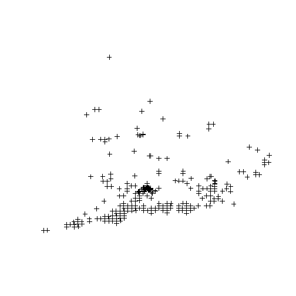 

Use `readShapePoly` to read polygon shapefiles, and `readShapeLines` to read polylines.
See also `shapefile` in `raster` package.   


<br>
<br>
<br>

Changing projection of spatial vector data <a name="changeproj"></a>
-------------------------------------------

`spTransform` (package `sp`) will do the projection as long as the original and new projection are correctly specified.

<br>

### Projecting point dataset

To illustrate, let's project the dataframe with Laurus nobilis coordinates that we obtained above:

```r
summary(locs)
```

```
## Object of class SpatialPointsDataFrame
## Coordinates:
##         min    max
## lon -123.25 145.04
## lat  -37.78  59.84
## Is projected: FALSE 
## proj4string :
## [+proj=longlat +ellps=WGS84 +datum=WGS84 +towgs84=0,0,0]
## Number of points: 2109
## Data attributes:
##    Length     Class      Mode 
##      2109 character character
```

The original coordinates are in lat lon format. Let's define the new desired projection:
Lambert Azimuthal Equal Area in this case 
(look up parameters at [http://spatialreference.org](http://spatialreference.org))

```r
crs.laea <- CRS("+proj=laea +lat_0=52 +lon_0=10 +x_0=4321000 +y_0=3210000 +ellps=GRS80 +units=m +no_defs")  # Lambert Azimuthal Equal Area
locs.laea <- spTransform(locs, crs.laea)  # spTransform makes the projection
```


<br>

### Projecting shapefile of countries

```r
plot(countriesLow)  # countries map in geographical projection
```

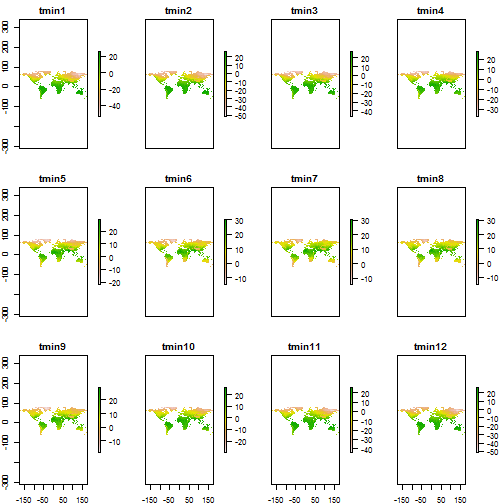 

```r
country.laea <- spTransform(countriesLow, crs.laea)  # project
```


Let's plot this:

```r
plot(locs.laea, pch = 20, col = "steelblue")
plot(country.laea, add = T)
```

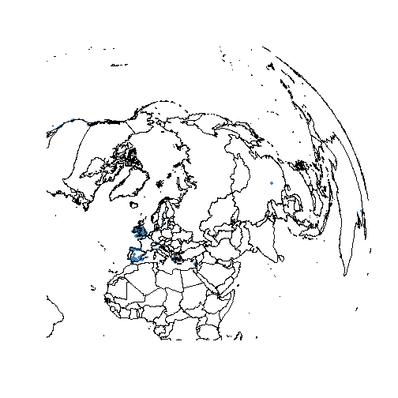 

```r

# define spatial limits for plotting
plot(locs.laea, pch = 20, col = "steelblue", xlim = c(1800000, 3900000), ylim = c(1e+06, 
    3e+06))
plot(country.laea, add = T)
```

 


<br>
[Back to Contents](#contents)
<br>
<br>
<br>
<br>
<br>
<br>


4. USING RASTER (GRID) DATA <a name="raster"></a>
===========================


<br>

### Downloading raster climate data from internet <a name="getdata"></a>
The `getData` function from the `dismo` package will easily retrieve climate data, elevation, administrative boundaries, etc. Check also the excellent [rWBclimate package](http://ropensci.org/packages/rwbclimate.html) by rOpenSci with additional functionality. 


```r
tmin <- getData("worldclim", var = "tmin", res = 10)  # this will download 
# global data on minimum temperature at 10' resolution
```


<br>

### Loading a raster layer <a name="loadraster"></a>


```r
tmin1 <- raster(paste(getwd(), "/wc10/tmin1.bil", sep = ""))  # Tmin for January
```

Easy! The `raster` function reads many different formats, including Arc ASCII grids or netcdf files (see raster help). And values are stored on disk instead of memory! (useful for large rasters) 

```r
fromDisk(tmin1)
```

```
## [1] TRUE
```


Let's examine the raster layer:

```r
tmin1 <- tmin1/10  # Worldclim temperature data come in decimal degrees 
tmin1  # look at the info
```

```
## class       : RasterLayer 
## dimensions  : 900, 2160, 1944000  (nrow, ncol, ncell)
## resolution  : 0.1667, 0.1667  (x, y)
## extent      : -180, 180, -60, 90  (xmin, xmax, ymin, ymax)
## coord. ref. : +proj=longlat +ellps=WGS84 +towgs84=0,0,0,0,0,0,0 +no_defs 
## data source : in memory
## names       : tmin1 
## values      : -54.7, 26.6  (min, max)
```

```r
plot(tmin1)
```

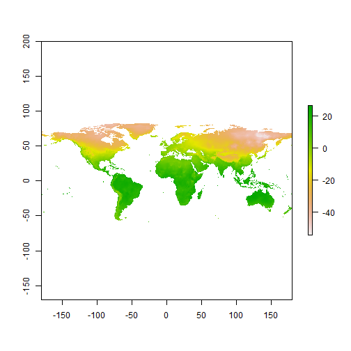 


<br>

### Creating a raster stack <a name="rasterstack"></a>

A raster stack is collection of many raster layers with the same projection, spatial extent and resolution.
Let's collect several raster files from disk and read them as a single raster stack:


```r

library(gtools)
file.remove(paste(getwd(), "/wc10/", "tmin_10m_bil.zip", sep = ""))
```

```
## [1] TRUE
```

```r
list.ras <- mixedsort(list.files(paste(getwd(), "/wc10/", sep = ""), full.names = T, 
    pattern = ".bil"))
list.ras  # I have just collected a list of the files containing monthly temperature values
```

```
##  [1] "C:/Users/FRS/Dropbox/R.scripts/my.Rcode/R-GIS tutorial/wc10/tmin1.bil" 
##  [2] "C:/Users/FRS/Dropbox/R.scripts/my.Rcode/R-GIS tutorial/wc10/tmin2.bil" 
##  [3] "C:/Users/FRS/Dropbox/R.scripts/my.Rcode/R-GIS tutorial/wc10/tmin3.bil" 
##  [4] "C:/Users/FRS/Dropbox/R.scripts/my.Rcode/R-GIS tutorial/wc10/tmin4.bil" 
##  [5] "C:/Users/FRS/Dropbox/R.scripts/my.Rcode/R-GIS tutorial/wc10/tmin5.bil" 
##  [6] "C:/Users/FRS/Dropbox/R.scripts/my.Rcode/R-GIS tutorial/wc10/tmin6.bil" 
##  [7] "C:/Users/FRS/Dropbox/R.scripts/my.Rcode/R-GIS tutorial/wc10/tmin7.bil" 
##  [8] "C:/Users/FRS/Dropbox/R.scripts/my.Rcode/R-GIS tutorial/wc10/tmin8.bil" 
##  [9] "C:/Users/FRS/Dropbox/R.scripts/my.Rcode/R-GIS tutorial/wc10/tmin9.bil" 
## [10] "C:/Users/FRS/Dropbox/R.scripts/my.Rcode/R-GIS tutorial/wc10/tmin10.bil"
## [11] "C:/Users/FRS/Dropbox/R.scripts/my.Rcode/R-GIS tutorial/wc10/tmin11.bil"
## [12] "C:/Users/FRS/Dropbox/R.scripts/my.Rcode/R-GIS tutorial/wc10/tmin12.bil"
```

```r
tmin.all <- stack(list.ras)
tmin.all
```

```
## class       : RasterStack 
## dimensions  : 900, 2160, 1944000, 12  (nrow, ncol, ncell, nlayers)
## resolution  : 0.1667, 0.1667  (x, y)
## extent      : -180, 180, -60, 90  (xmin, xmax, ymin, ymax)
## coord. ref. : +proj=longlat +ellps=WGS84 +towgs84=0,0,0,0,0,0,0 +no_defs 
## names       : tmin1, tmin2, tmin3, tmin4, tmin5, tmin6, tmin7, tmin8, tmin9, tmin10, tmin11, tmin12 
## min values  :  -547,  -525,  -468,  -379,  -225,  -170,  -171,  -178,  -192,   -302,   -449,   -522 
## max values  :   266,   273,   277,   283,   295,   312,   311,   312,   300,    268,    267,    268
```

```r
tmin.all <- tmin.all/10
plot(tmin.all)
```

 


<br>

### Raster bricks <a name="rasterbrick"></a>

A rasterbrick is similar to a raster stack (i.e. multiple layers with the same extent and resolution), but all the data must be stored in a single file on disk.


```r
tmin.brick <- brick(tmin.all)  # creates rasterbrick
```


<br>

### Crop rasters <a name="cropraster"></a>

Crop raster manually (drawing region of interest):


```r
plot(tmin1)
newext <- drawExtent()  # click twice on the map to select the region of interest
tmin1.c <- crop(tmin1, newext)
plot(tmin1.c)
```


Alternatively, provide coordinates for the limits of the region of interest:

```r
newext <- c(-10, 10, 30, 50)
tmin1.c <- crop(tmin1, newext)
plot(tmin1.c)
```

 

```r

tmin.all.c <- crop(tmin.all, newext)
plot(tmin.all.c)
```

 


<br>

### Define spatial projection of the rasters <a name="projectionraster"></a>


```r
crs.geo  # defined above
```

```
## CRS arguments:
##  +proj=longlat +ellps=WGS84 +datum=WGS84 +towgs84=0,0,0
```

```r
projection(tmin1.c) <- crs.geo
projection(tmin.all.c) <- crs.geo
tmin1.c  # notice info at coord.ref.
```

```
## class       : RasterLayer 
## dimensions  : 120, 120, 14400  (nrow, ncol, ncell)
## resolution  : 0.1667, 0.1667  (x, y)
## extent      : -10, 10, 30, 50  (xmin, xmax, ymin, ymax)
## coord. ref. : +proj=longlat +ellps=WGS84 +datum=WGS84 +towgs84=0,0,0 
## data source : in memory
## names       : tmin1 
## values      : -12.3, 10.3  (min, max)
```


<br>

### Changing projection <a name="changeprojraster"></a>

Use `projectRaster` function:

```r
tmin1.proj <- projectRaster(tmin1.c, crs = "+proj=merc +lon_0=0 +k=1 +x_0=0 +y_0=0 +a=6378137 +b=6378137 +units=m +no_defs")  # can also use a template raster, see ?projectRaster
tmin1.proj  # notice info at coord.ref.
```

```
## class       : RasterLayer 
## dimensions  : 132, 134, 17688  (nrow, ncol, ncell)
## resolution  : 18600, 24200  (x, y)
## extent      : -1243395, 1249005, 3372876, 6567276  (xmin, xmax, ymin, ymax)
## coord. ref. : +proj=merc +lon_0=0 +k=1 +x_0=0 +y_0=0 +a=6378137 +b=6378137 +units=m +no_defs 
## data source : in memory
## names       : tmin1 
## values      : -11.59, 10.3  (min, max)
```

```r
plot(tmin1.proj)
```

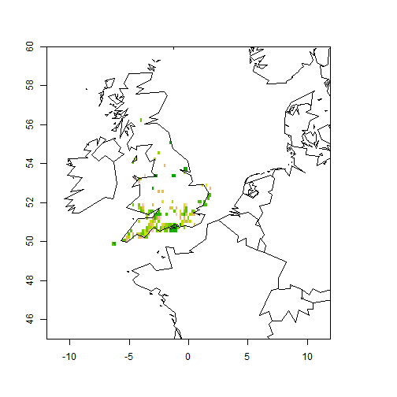 


<br>

### Plotting raster data <a name="plotraster"></a>

Different plotting functions:

```r
histogram(tmin1.c)
```

 

```r
pairs(tmin.all.c)
```

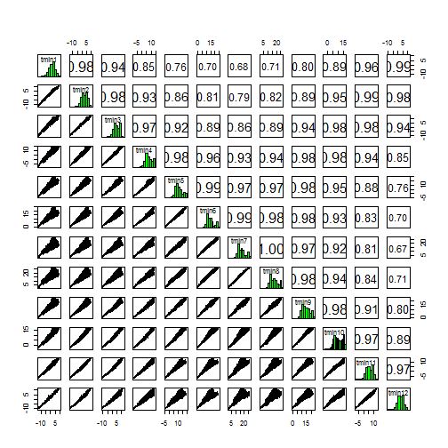 

```r
persp(tmin1.c)
```

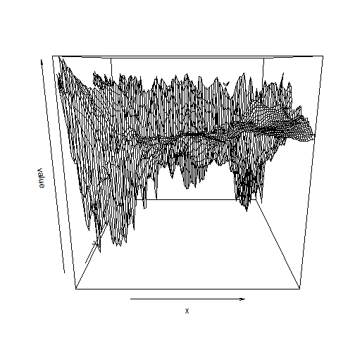 

```r
contour(tmin1.c)
```

 

```r
contourplot(tmin1.c)
```

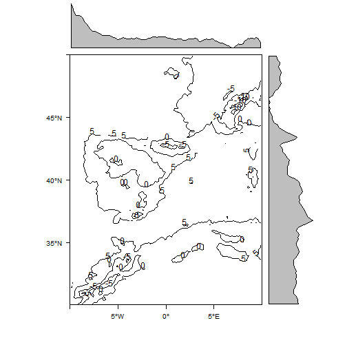 

```r
levelplot(tmin1.c)
```

 

```r
# plot3D(tmin1.c)
bwplot(tmin.all.c)
```

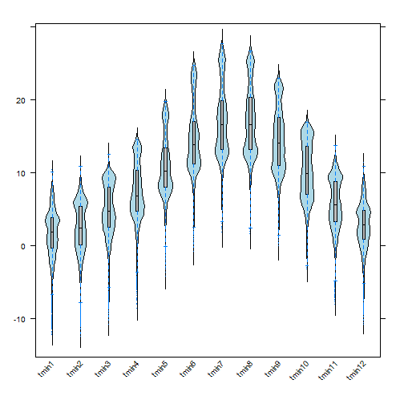 

```r
densityplot(tmin1.c)
```

 


### Spatial autocorrelation <a name="autocorrelation"></a>


```r
Moran(tmin1.c)  # global Moran's I
```

```
## [1] 0.9099
```

```r
tmin1.Moran <- MoranLocal(tmin1.c)
plot(tmin1.Moran)
```

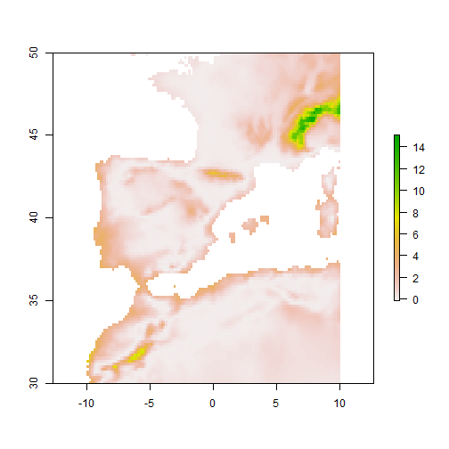 


### Extract values from raster <a name="extract"></a>

Use `extract` function:

```r
head(locs)  # we'll obtain tmin values for our points
```

```
##   country
## 1   Spain
## 2   Spain
## 3   Spain
## 4   Spain
## 5   Spain
## 6   Spain
```

```r
projection(tmin1) <- crs.geo
locs$tmin1 <- extract(tmin1, locs)  # raster values 
# are incorporated to the dataframe
head(locs)
```

```
##   country tmin1
## 1   Spain   6.7
## 2   Spain   2.1
## 3   Spain   6.7
## 4   Spain   4.2
## 5   Spain   6.2
## 6   Spain   6.7
```


You can also extract values for a given region instead of the whole raster:

```r
plot(tmin1.c)
reg.clim <- extract(tmin1.c, drawExtent())  # click twice to 
# draw extent of the region of interest
summary(reg.clim)
```


Using `rasterToPoints`:

```r
# rasterToPoints
tminvals <- rasterToPoints(tmin1.c)
head(tminvals)
```

```
##            x     y tmin1
## [1,] -6.4167 49.92   4.2
## [2,] -6.2500 49.92   4.2
## [3,] -5.2500 49.92   2.4
## [4,]  0.5833 49.92   1.0
## [5,]  0.7500 49.92   1.0
## [6,]  0.9167 49.92   1.0
```


And also, the `click` function will get values from particular locations in the map

```r
plot(tmin1.c)
click(tmin1.c, n = 3)  # click n times in the map to get values
```


<br>

### Rasterize points, lines or polygons <a name="rasterize"></a>


```r
locs2ras <- rasterize(locs.gb, tmin1, field = rep(1, nrow(locs.gb)))
locs2ras
```

```
## class       : RasterLayer 
## dimensions  : 900, 2160, 1944000  (nrow, ncol, ncell)
## resolution  : 0.1667, 0.1667  (x, y)
## extent      : -180, 180, -60, 90  (xmin, xmax, ymin, ymax)
## coord. ref. : +proj=longlat +ellps=WGS84 +datum=WGS84 +towgs84=0,0,0 
## data source : in memory
## names       : layer 
## values      : 1, 1  (min, max)
```

```r
plot(locs2ras, xlim = c(-10, 10), ylim = c(45, 60), legend = F)
data(wrld_simpl)
plot(wrld_simpl, add = T)
```

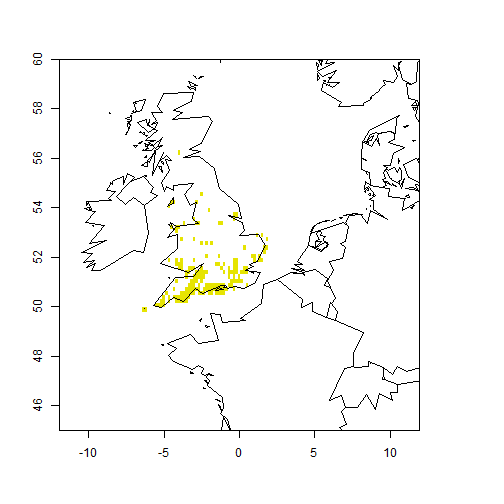 


<br>

### Changing raster resolution <a name="resolution"></a>

Use `aggregate` function:

```r
tmin1.lowres <- aggregate(tmin1.c, fact = 2, fun = mean)
tmin1.lowres
```

```
## class       : RasterLayer 
## dimensions  : 60, 60, 3600  (nrow, ncol, ncell)
## resolution  : 0.3333, 0.3333  (x, y)
## extent      : -10, 10, 30, 50  (xmin, xmax, ymin, ymax)
## coord. ref. : +proj=longlat +ellps=WGS84 +datum=WGS84 +towgs84=0,0,0 
## data source : in memory
## names       : tmin1 
## values      : -10.57, 10.1  (min, max)
```

```r
tmin1.c  # compare
```

```
## class       : RasterLayer 
## dimensions  : 120, 120, 14400  (nrow, ncol, ncell)
## resolution  : 0.1667, 0.1667  (x, y)
## extent      : -10, 10, 30, 50  (xmin, xmax, ymin, ymax)
## coord. ref. : +proj=longlat +ellps=WGS84 +datum=WGS84 +towgs84=0,0,0 
## data source : in memory
## names       : tmin1 
## values      : -12.3, 10.3  (min, max)
```

```r
par(mfcol = c(1, 2))
plot(tmin1.c, main = "original")
plot(tmin1.lowres, main = "low resolution")
```

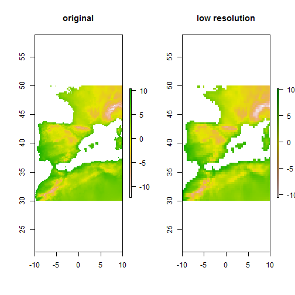 


### Spline interpolation <a name="interpolation"></a>


```r
xy <- data.frame(xyFromCell(tmin1.lowres, 1:ncell(tmin1.lowres)))  # get raster cell coordinates
head(xy)
```

```
##        x     y
## 1 -9.833 49.83
## 2 -9.500 49.83
## 3 -9.167 49.83
## 4 -8.833 49.83
## 5 -8.500 49.83
## 6 -8.167 49.83
```

```r
vals <- getValues(tmin1.lowres)
library(fields)
spline <- Tps(xy, vals)  # thin plate spline
intras <- interpolate(tmin1.c, spline)
intras  # note new resolution
```

```
## class       : RasterLayer 
## dimensions  : 120, 120, 14400  (nrow, ncol, ncell)
## resolution  : 0.1667, 0.1667  (x, y)
## extent      : -10, 10, 30, 50  (xmin, xmax, ymin, ymax)
## coord. ref. : +proj=longlat +ellps=WGS84 +datum=WGS84 +towgs84=0,0,0 
## data source : in memory
## names       : layer 
## values      : -10.43, 13.16  (min, max)
```

```r
plot(intras)
```

 

```r
intras <- mask(intras, tmin1.c)  # mask to land areas only
plot(intras)
title("Interpolated raster")
```

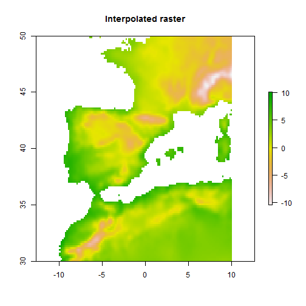 


### Setting all rasters to the same extent, projection and resolution all in one <a name="spatialsync"></a>

See `spatial_sync_raster` function from `spatial.tools` package.

<br>


### Elevations, slope, aspect, etc <a name="elevation"></a>

<br>
Download elevation data from internet:

```r
elevation <- getData("alt", country = "ESP")
```


Some quick maps:

```r
x <- terrain(elevation, opt = c("slope", "aspect"), unit = "degrees")
plot(x)
```

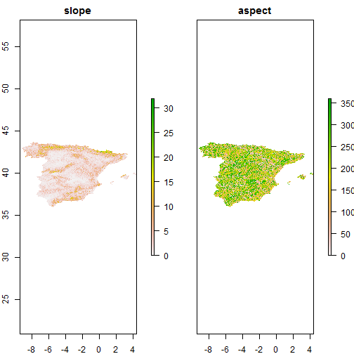 

```r

slope <- terrain(elevation, opt = "slope")
aspect <- terrain(elevation, opt = "aspect")
hill <- hillShade(slope, aspect, 40, 270)
plot(hill, col = grey(0:100/100), legend = FALSE, main = "Spain")
plot(elevation, col = rainbow(25, alpha = 0.35), add = TRUE)
```

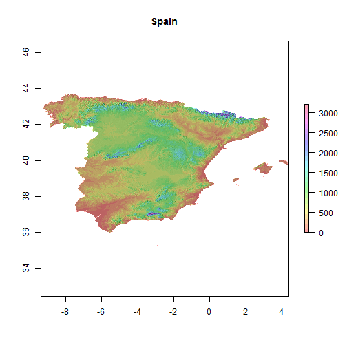 


### Saving and exporting raster data <a name="saveraster"></a>


Saving raster to file:


```r
writeRaster(tmin1.c, filename = "tmin1.c.grd")
```

```
## class       : RasterLayer 
## dimensions  : 120, 120, 14400  (nrow, ncol, ncell)
## resolution  : 0.1667, 0.1667  (x, y)
## extent      : -10, 10, 30, 50  (xmin, xmax, ymin, ymax)
## coord. ref. : +proj=longlat +ellps=WGS84 +datum=WGS84 +towgs84=0,0,0 
## data source : C:\Users\FRS\Dropbox\R.scripts\my.Rcode\R-GIS tutorial\tmin1.c.grd 
## names       : tmin1 
## values      : -12.3, 10.3  (min, max)
```

```r
writeRaster(tmin.all.c, filename = "tmin.all.grd")
```

```
## class       : RasterBrick 
## dimensions  : 120, 120, 14400, 12  (nrow, ncol, ncell, nlayers)
## resolution  : 0.1667, 0.1667  (x, y)
## extent      : -10, 10, 30, 50  (xmin, xmax, ymin, ymax)
## coord. ref. : +proj=longlat +ellps=WGS84 +datum=WGS84 +towgs84=0,0,0 
## data source : C:\Users\FRS\Dropbox\R.scripts\my.Rcode\R-GIS tutorial\tmin.all.grd 
## names       : tmin1, tmin2, tmin3, tmin4, tmin5, tmin6, tmin7, tmin8, tmin9, tmin10, tmin11, tmin12 
## min values  : -12.3, -12.5, -10.8,  -8.6,  -4.2,  -0.8,   1.8,   1.6,  -0.1,   -3.3,   -8.1,  -10.8 
## max values  :  10.3,  10.8,  12.5,  14.5,  19.7,  24.7,  27.6,  26.7,  22.9,   16.9,   13.7,   11.3
```

`writeRaster` can export to many different file types, see help.

<br>

Exporting to KML (Google Earth)

```r
tmin1.c <- raster(tmin.all.c, 1)
KML(tmin1.c, file = "tmin1.kml")
KML(tmin.all.c)  # can export multiple layers
```


<br>
[Back to Contents](#contents)
<br>
<br>
<br>
<br>

5. SPATIAL STATISTICS (just a glance) <a name="spatstats"></a>
=====================================

<br>

### Point pattern analysis <a name="pointpatterns"></a>

Some useful packages:


```r
library(spatial)
library(spatstat)
library(spatgraphs)
library(ecespa)  # ecological focus
```

See [CRAN Spatial Task View](http://cran.r-project.org/web/views/Spatial.html).

Let's do a quick example with Ripley's K function:

```r
data(fig1)
plot(fig1)  # point pattern
```

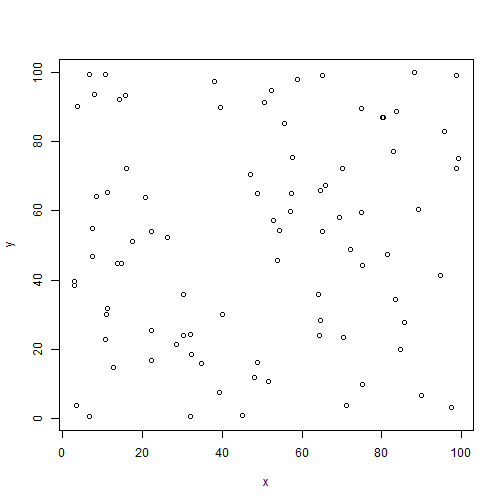 

```r
data(Helianthemum)
cosa12 <- K1K2(Helianthemum, j = "deadpl", i = "survpl", r = seq(0, 200, le = 201), 
    nsim = 99, nrank = 1, correction = "isotropic")
```

```
## 1, 2, 3, 4, 5, 6, 7, 8, 9, 10, 11, 12, 13, 14, 15,
## 16, 17, 18, 19, 20, 21, 22, 23, 24, 25, 26, 27, 28, 29, 30,
## 31, 32, 33, 34, 35, 36, 37, 38, 39, 40, 41, 42, 43, 44, 45,
## 46, 47, 48, 49, 50, 51, 52, 53, 54, 55, 56, 57, 58, 59, 60,
## 61, 62, 63, 64, 65, 66, 67, 68, 69, 70, 71, 72, 73, 74, 75,
## 76, 77, 78, 79, 80, 81, 82, 83, 84, 85, 86, 87, 88, 89, 90,
## 91, 92, 93, 94, 95, 96, 97, 98,  99.
```

```r
plot(cosa12$k1k2, lty = c(2, 1, 2), col = c(2, 1, 2), xlim = c(0, 200), main = "survival- death", 
    ylab = expression(K[1] - K[2]), legend = FALSE)
```

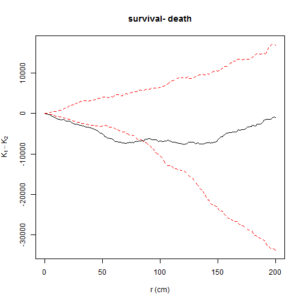 

```
##       lty col   key         label
## lo      2   2    lo         lo(r)
## K1-K2   1   1 K1-K2 K1(r) - K2(r)
## hi      2   2    hi         hi(r)
##                                                                               meaning
## lo                                            lower pointwise envelope of simulations
## K1-K2 differences of  Ripley isotropic correction estimate of expression(K[1] - K[2])
## hi                                            upper pointwise envelope of simulations
```


<br>

### Geostatistics <a name="geostatistics"></a>

Some useful packages:


```r
library(gstat)
library(geoR)
library(akima)  # for spline interpolation
library(spdep)  # dealing with spatial dependence
```

See [CRAN Spatial Task View](http://cran.r-project.org/web/views/Spatial.html).


<br>
[Back to Contents](#contents)
<br>
<br>
<br>
<br>

6. INTERACTING WITH OTHER GIS <a name="othergis"></a>
===============================================


```r
library(spgrass6)  # GRASS
library(RPyGeo)  # ArcGis (Python)
library(RSAGA)  # SAGA
library(spsextante)  # Sextante 

```


<br>
[Back to Contents](#contents)
<br>
<br>
<br>
<br>


7. OTHER USEFUL PACKAGES <a name="otherpackages"></a>
=========================


```r
library(Metadata)  # automatically collates data from online GIS datasets (land cover, pop density, etc) for a given set of coordinates

# library(GeoXp) # Interactive exploratory spatial data analysis
example(columbus)
histomap(columbus, "CRIME")

library(maptools)
# readGPS

library(rangeMapper)  # plotting species distributions, richness and traits


# Species Distribution Modelling
library(dismo)
library(biomod2)
library(SDMTools)

library(BioCalc)  # computes 19 bioclimatic variables from monthly climatic values (tmin, tmax, prec)

```


<br>
[Back to Contents](#contents)
<br>
<br>
<br>
<br>

8. TO LEARN MORE <a name="tolearnmore"></a>
================

* [ASDAR book](http://www.asdar-book.org/)

* Packages help and vignettes, especially

    http://cran.r-project.org/web/packages/raster/vignettes/Raster.pdf   
    http://cran.r-project.org/web/packages/dismo/vignettes/sdm.pdf   
    http://cran.r-project.org/web/packages/sp/vignettes/sp.pdf   

* [CRAN Task View: Analysis of Spatial Data](http://cran.r-project.org/web/views/Spatial.html)


* [Introduction to Spatial Data and ggplot2](http://rpubs.com/RobinLovelace/intro-spatial)

* [R spatial tips](http://spatial.ly/category/r-spatial-data-hints/)

* [R wiki: tips for spatial data](http://rwiki.sciviews.org/doku.php?id=tips:spatial-data&s=spatial)

* [Spatial analysis in R](http://www.maths.lancs.ac.uk/~rowlings/Teaching/Sheffield2013/index.html)

* [Displaying time series, spatial and space-time data with R](http://oscarperpinan.github.io/spacetime-vis/)

* [Notes on Spatial Data Operations in R](https://dl.dropboxusercontent.com/u/9577903/broomspatial.pdf)

* [Analysing spatial point patterns in R](http://www.csiro.au/resources/pf16h)

* [Spatial data in R](http://science.nature.nps.gov/im/datamgmt/statistics/r/advanced/Spatial.cfm)

* [NCEAS Geospatial use cases](http://www.nceas.ucsb.edu/scicomp/usecases)

* [Spatial Analyst](http://spatial-analyst.net)

* [Making maps with R](http://www.molecularecologist.com/2012/09/making-maps-with-r/)

* [The Visual Raster Cheat Sheet](http://www.rpubs.com/etiennebr/visualraster)

* [R-SIG-Geo mailing list](https://stat.ethz.ch/mailman/listinfo/R-SIG-Geo)


<br>
[Back to Contents](#contents)
<br>
<br>
<br>
<br>
